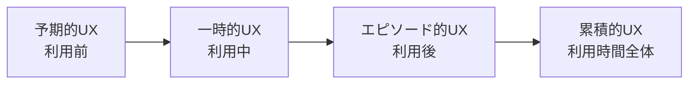

# lesson01: UXとは — 定義と構成要素

## このレッスンで学ぶこと

- UX（ユーザーエクスペリエンス、ユーザー体験）の代表的な定義を理解する
- UXが「利用中」だけでなく利用前後を含む時間軸を持つことを理解する
- UXの構成要素を示す代表的なモデル（ハニカム構造・5階層モデルなど）を知る
- UI・ユーザビリティ・CX・EX・DXとUXの違いと関係を説明できる

## UXとは

UX（ユーザーエクスペリエンス、ユーザー体験）とは、**製品やサービスを通じてユーザーに生まれる体験のすべて**を指す言葉です。

たとえば調味料のボトルを思い浮かべてください。「フタが下向きだから最後まで使い切れそう」と感じて選び、「欲しい分だけ出せて便利」と使い、「次もこれにしよう」と決める。この一連の知覚・感情・行動のすべてがUXです。

### 代表的な定義

UXには複数の定義があります。試験対策としては、どの団体・人物がどう定義しているかを区別して覚えることが重要です。

| 出典 | 定義の要旨 |
|------|-----------|
| ISO 9241-210 | 製品・システム・サービスを使用した時、および使用を予測した時に生じる個人の知覚や反応 |
| ニールセン・ノーマングループ | エンドユーザーと企業・サービス・製品との相互作用のすべての側面を包括した概念 |
| UXPA | 製品・サービス・企業とのインタラクションについて、ユーザーの全体的な知覚を形作るあらゆる側面 |
| UXインテリジェンス協会 | 「企業・サービス・製品」と「関わるあらゆる人々」との関係を形作る「相互作用のすべて」 |

::: tip 定義に共通するポイント
表現は違っても「**使用時だけでなく予測（期待）も含む**」「**個別の機能ではなく相互作用の全体**」という2点が共通しています。
:::

## UXの時間軸（UX白書のモデル）

UX白書（2011）は、UXを「利用中」だけでなく**利用前・利用後を含む4つの期間**で捉えるモデルを示しました。

| 期間 | 名称 | 内容 |
|------|------|------|
| 利用前 | 予期的UX | 体験を想像する（広告や口コミから期待を持つ） |
| 利用中 | 一時的UX | 体験する（操作して感じる） |
| 利用後 | エピソード的UX | ある体験を内省する（使った体験を振り返る） |
| 利用時間全体 | 累積的UX | 多種多様な利用期間を回想する（使い続けた総体としての印象） |

::: info なぜ時間軸が重要か
UXを「画面の使いやすさ」だけで捉えると、購入前の期待づくりや、使い続けた先のロイヤルティ形成を見落とします。時間軸の視点は [lesson22](/lessons/lesson22/) のカスタマージャーニーマップにもつながります。
:::

## UXの構成要素を示すモデル

「よいUX」を分解して考えるための代表的なモデルが3つあります。

### UXのハニカム構造（ピーター・モービル）

UXを7つの品質で表した蜂の巣型のモデルです。中心に「価値がある（Valuable）」を置きます。

- 役に立つ（Useful）
- 使いやすい（Usable）
- 好ましい（Desirable）
- 見つけやすい（Findable）
- アクセスしやすい（Accessible）
- 信頼できる（Credible）
- 価値がある（Valuable）

### UXの5階層モデル（ジェシー・ジェームズ・ギャレット）

UXデザインの検討事項を、抽象から具体への5つの階層で表したモデルです。下の階層から順に積み上げて設計します。

1. 戦略（ユーザーニーズとサービスの目的）
2. 要件（提供する機能・コンテンツ）
3. 構造（情報の構成とインタラクションの設計）
4. 骨格（画面レイアウト・ナビゲーション）
5. 表層（ビジュアルデザイン）

### ハッセンツァール・モデル

製品の品質を、目標達成に関わる**実用的品質**（使いやすさ・有用さ）と、楽しさや自己表現に関わる**快楽的品質**の2軸で捉えるモデルです。よいUXには両方が必要だと示した点が特徴です。

## 似た言葉との違いと関係

UXと混同されやすい言葉を整理します。いずれも「UXと同じ意味」ではありません。

| 用語 | 意味 | UXとの関係 |
|------|------|-----------|
| UI | ユーザーインターフェース。画面・ボタン・操作など製品とユーザーの個別の接点 | UIは接点、UXは接点を通じて生まれる体験。UIはUXを構成する一要素 |
| ユーザビリティ | 特定の利用状況での使いやすさ（詳細は [lesson14](/lessons/lesson14/)） | UXの一部。使いやすくても体験全体がよいとは限らない |
| CX | カスタマーエクスペリエンス。顧客としての体験（購買・サポートなどを含む） | UXとほぼ重なるが「顧客」に焦点を当てた言葉 |
| EX | エンプロイーエクスペリエンス。従業員としての体験 | 体験デザインの対象を従業員に広げた言葉 |
| DX | デジタルトランスフォーメーション。デジタル技術による事業・組織の変革 | DXの成否はUXの質に大きく左右される（詳細は [lesson02](/lessons/lesson02/)） |

::: warning UIとUXを混同しない
「UI/UX」とひとまとめに呼ばれることがありますが、UIは**接点（インターフェース）**、UXは**体験**であり、別の概念です。きれいなUIでも、待ち時間が長ければUXは悪くなります。
:::

## キーワード

| 用語 | 説明 |
|------|------|
| UX（ユーザーエクスペリエンス） | 製品・サービスの利用（予測を含む）を通じてユーザーに生じる知覚・反応・体験のすべて |
| ISO 9241-210 | 人間中心デザインの国際規格。UXの定義を含む |
| UX白書 | UXを予期的・一時的・エピソード的・累積的の4期間で整理した文書（2011） |
| ハニカム構造 | UXを7つの品質で表したピーター・モービルのモデル |
| 5階層モデル | UXデザインを戦略〜表層の5層で表したギャレットのモデル |
| ハッセンツァール・モデル | 実用的品質と快楽的品質の2軸で製品の品質を捉えるモデル |
| UI | ユーザーとの個別の接点（画面・ボタン・店員・容器など） |
| CX / EX | 顧客体験 / 従業員体験。体験デザインの対象を表す言葉 |

## 試験のポイント

- ISO 9241-210 の定義は「**使用を予測した時**」を含む点が問われやすい
- UX白書の4期間（予期的・一時的・エピソード的・累積的）と「利用前・中・後・全体」の対応を正確に覚える
- ハニカム構造（7要素）・5階層モデル（5層）・ハッセンツァール・モデル（2品質）は、提唱者と要素数をセットで覚える
- 「UIは接点、UXは体験」という区別は頻出。ユーザビリティとUXの包含関係（ユーザビリティはUXの一部）も整理しておく
