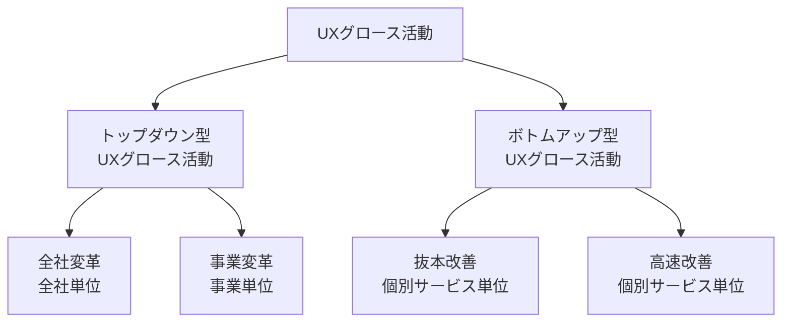

# lesson04: UXグロース — バリュージャーニー時代のビジネスと改善活動

## このレッスンで学ぶこと

- アフターデジタル（オフラインがオンラインに包含される世界）の考え方を理解する
- バリューチェーン型からバリュージャーニー型への価値提供モデルの転換を説明できる
- バリュージャーニー型の代表的な3つの収益モデルを知る
- UXグロースの2つの活動（トップダウン型・ボトムアップ型）とグロースチームの役割を理解する

## アフターデジタルとは

**アフターデジタル**とは、モバイルやセンサーの普及によって**オフライン（リアル）がオンライン（デジタル）に包含される世界**を指す言葉です。藤井保文氏の著書『アフターデジタル』シリーズで広まりました。

- ビフォアデジタル: リアルが主役で、デジタルはリアルに付け足された一接点にすぎない
- アフターデジタル: 顧客は常時オンラインにつながっており、デジタルが起点になる。リアル接点は「レアで貴重な場」として位置づけ直される

この世界では、あらゆる接点から行動データが得られ、顧客理解の解像度が大きく高まります。その結果、企業競争の焦点は「製品単体の機能・性能」から「体験全体の質」へ移ります（背景となる社会変化は [lesson02](/lessons/lesson02/) を参照）。

## バリューチェーンからバリュージャーニーへ

### 従来型のバリューチェーン

**バリューチェーン**は、「創る・作る・売る」という企業側の価値の連鎖を中心に置く従来型のモデルです。次の3点が特徴です。

- 企業は製品の機能を作って届ける**機能提供者**である
- 売った時点で取引が完結する**売り切り型収益モデル**をとる
- 認知から購入へと顧客を絞り込む**ファネル型マーケティング**で、新規顧客の獲得を重視する

### 新しいバリュージャーニー

**バリュージャーニー**は、顧客が成功にたどり着くまでの一連の行動フロー（ジャーニー）に、すべての接点を統合して寄り添い続けるモデルです。企業は機能提供者ではなく、成功体験そのものを支援する**体験提供型**の存在になります。

| 観点 | バリューチェーン型 | バリュージャーニー型 |
|------|------------------|--------------------|
| 企業の立ち位置 | 機能提供者 | 体験提供型（成功体験の支援者） |
| 提供価値 | 製品単体の機能・性能・価格 | 一連の行動フロー全体の体験 |
| 収益モデル | 売り切り型収益モデル | 継続的な関係を前提にした収益モデル |
| マーケティング | ファネル型マーケティング（新規獲得を重視） | ジャーニーに乗り続けてもらう（LTVを重視） |
| 顧客との関係 | 購入・契約の時点がゴール | 購入後もずっと寄り添い続ける |

旅行を例にすると、従来は旅行雑誌・レンタカー・カメラなど別々の企業の道具を顧客が自分で組み合わせていました。アフターデジタルでは、計画から思い出づくりまでの一連の行動フローを単一の企業が横断的に支援できます。

## 収益モデルの変化

バリュージャーニー型では「売って終わり」ではない収益のあげ方が中心になります。代表的な収益モデルは次の3つです。

| 収益モデル | 内容 | 例 |
|-----------|------|----|
| ジャーニー使用料請求モデル | ジャーニーに乗り続けてもらい、利用に応じて継続的に対価を受け取る | サブスクリプション、月額会員サービス |
| 無料版ジャーニーへの潜在顧客滞留 | 無料のジャーニーに潜在顧客がとどまる状態を作り、最適なタイミングで有料サービスへ案内する | フリーミアム型のアプリ |
| 特定シーンにおける大きな成功 | 日常的に寄り添う中で、重要な場面に大きな成功体験を提供して大きな対価を得る | 保険・住宅・自動車などの高額商材の提案 |

いずれも、顧客がジャーニーから離脱しないだけのUXの質が前提になります。だからこそ、UXを継続的に成長させる活動が必要です。

## UXグロースとは

**UXグロース**とは、行動データやインサイトをUXに還元し、バリュージャーニー（すなわちビジネス）を成長させ続ける活動です。活動の方向は大きく2つあります。

- 既存の接点をデータをもとに改善し、ジャーニーを磨き込む
- 新たなデジタル接点を加えて、ジャーニーを伸長する

### 活動の単位: トップダウン型とボトムアップ型

UXグロース活動は、全社単位・事業単位・個別サービス単位の取り組みに整理できます。

- **トップダウン型UXグロース活動**: 経営層が主導し、全社や事業をバリュージャーニー型へ変革する取り組み
- **ボトムアップ型UXグロース活動**: 現場が主導し、個別サービスのUXを継続的に改善する取り組み。一般に「UXグロース」と言うときはこちらを指す

現場の業務が変わらなければジャーニーは成長しないため、ボトムアップ型の定着がとくに重要だとされています。

### ボトムアップ型の2つの改善

ボトムアップ型UXグロース活動は、頻度と深さの異なる2つの改善に分かれます。

| 改善 | 頻度 | 内容 |
|------|------|------|
| 抜本改善 | 年に数回 | 市場環境の変化や定性的なユーザー理解も踏まえて、提供価値そのものを見直す |
| 高速改善 | 日常的 | 成果に直結する特定のトピックについて、行動データをもとに小さな改善を高速に繰り返す |

どちらも次の4ステップで進めます。

1. UX改善テーマの設定
2. 現状のUXの理解
3. 行動ギャップの発見・要因分析
4. UX改善案の企画

::: warning 数値だけの判断は失敗のもと
「定着ユーザーは月4回使う」という数値だけを見てクーポンを配っても成果は出ません。行動パターンからユーザー像を理解して初めて、効果的な打ち手につながります。すべての土台はユーザー理解です。
:::

### グロースチーム

リリース後のサービスを成長させ続けるには、UXグロース活動を専任で担う**グロースチーム**が必要です。ビジネス・UXデザイン・データ分析などの専門性を持つメンバーが協働し、改善のサイクルを回し続けます。チームを支える組織づくりは [lesson31](/lessons/lesson31/)、活動の土台となる能力と精神（UXインテリジェンス）は [lesson05](/lessons/lesson05/) で扱います。

## キーワード

| 用語 | 説明 |
|------|------|
| アフターデジタル | オフラインがオンラインに包含され、デジタルが起点になる世界観 |
| バリューチェーン | 「創る・作る・売る」という企業側の価値の連鎖を中心に置く従来型モデル |
| バリュージャーニー | 顧客の一連の行動フローに接点を統合して寄り添い続ける新しいモデル |
| 機能提供者 / 体験提供型 | 製品の機能を売る従来の立ち位置と、成功体験を支援する新しい立ち位置 |
| 売り切り型収益モデル | 販売時点で取引が完結する従来の収益モデル |
| ファネル型マーケティング | 認知から購入へ顧客を絞り込み、新規獲得を重視する従来の手法 |
| ジャーニー使用料請求モデル | ジャーニーの継続利用に応じて対価を得る収益モデル |
| 無料版ジャーニーへの潜在顧客滞留 | 無料のジャーニーで潜在顧客との接点を保ち、有料サービスへつなぐ収益モデル |
| 特定シーンにおける大きな成功 | 重要な場面で大きな成功体験を提供し、大きな対価を得る収益モデル |
| UXグロース | データやインサイトをUXに還元し、ジャーニー（ビジネス）を成長させる活動 |
| トップダウン型 / ボトムアップ型UXグロース活動 | 経営層が主導する全社変革・事業変革 / 現場が主導する個別サービスの改善 |
| 抜本改善 / 高速改善 | 年に数回の価値の見直しと、日常的な高速の改善 |
| グロースチーム | UXグロース活動を専任で担う多職種のチーム |

## 試験のポイント

- アフターデジタルは「デジタルはリアルの付け足し」という従来の見方の逆で、**オフライン（リアル）がオンライン（デジタル）に包含される**という向きで覚える
- バリューチェーン型の3点セット（機能提供者・売り切り型収益モデル・ファネル型マーケティング）と、バリュージャーニー型の特徴（体験提供型・寄り添い続ける）を対で覚える
- 収益モデル3つ（ジャーニー使用料請求モデル・無料版ジャーニーへの潜在顧客滞留・特定シーンにおける大きな成功）は名称と内容の組み合わせが問われやすい
- トップダウン型は全社変革・事業変革、ボトムアップ型は抜本改善・高速改善という対応を正確に覚える
- 抜本改善は「年に数回・価値の見直し」、高速改善は「日常的・特定トピック」という頻度と深さの違いを区別する
