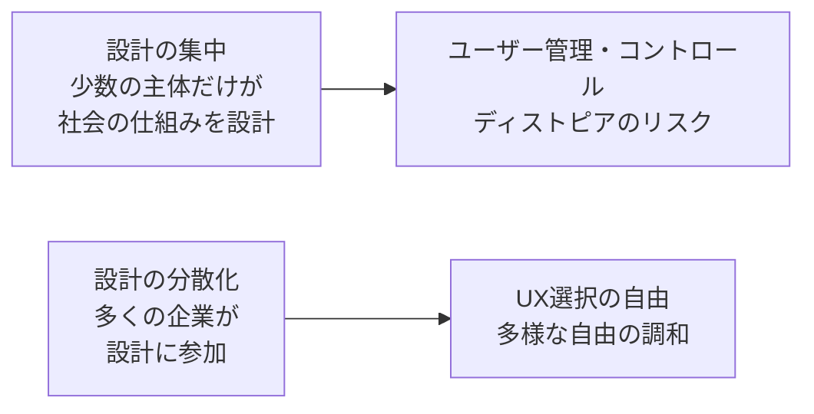

# lesson05: UXインテリジェンスとは — UX時代に求められる精神と能力

## このレッスンで学ぶこと

- UXインテリジェンスの定義（精神と能力の2つの側面）を理解する
- UXインテリジェンスが必要とされる背景（テクノロジー悪用によるディストピアのリスク）を理解する
- 目指す社会像（UX選択の自由・多様な自由の調和・社会アーキテクチャーの設計の分散化）を説明できる
- 能力面の中核である「UX企画力」の構成（ユーザー理解を土台にした4つの重要ワード）を整理する

## UXインテリジェンスとは

UXインテリジェンスとは、**デジタルが前提となった時代に、より善い社会をつくるためにあらゆる提供者が持つべき精神（マインド）と能力（スキル）**のことです。

書籍『アフターデジタル2 UXと自由』で提唱された考え方で、UXインテリジェンス協会（UXIA）の理念の中核になっています。

| 側面 | 内容 |
|------|------|
| 精神（マインド） | テクノロジーとデータの力を、企業の搾取ではなくユーザーへのUX還元に使う姿勢。新しいUXの提供で自由のアップデートに挑戦し、企業と社会をユーザーの管理・コントロールに向かわせない |
| 能力（スキル） | 定量・定性のデータやインサイトを活用し、新しいUXの創造や既存UXの改善を実現する能力。一言で表すと「UX企画力」 |

::: tip 専門家だけのものではない
UXインテリジェンスは、デザイナーやリサーチャーといった専門家だけのものではありません。データと顧客接点に関わるすべてのビジネスパーソンが持つべきものとされています。
:::

## 必要とされる背景

### テクノロジー悪用によるディストピアのリスク

UXとテクノロジーを掛け合わせた力は非常に強力です。使い方を誤ると、社会を管理・監視が行き届いた「ディストピア」に向かわせる最強の道具にもなり得ます。

- ユーザーに不義理な形でデータを使い、企業だけが利益を得る
- ダークパターンなどの仕掛けで、ユーザーの行動を企業に都合よく操作する
- 行動データを使った過度な**ユーザー管理・コントロール**（監視社会化）

こうした**テクノロジー悪用によるディストピア**を避けることが、UXインテリジェンスの出発点にある問題意識です。

### データのUX還元という企業の責務

ユーザーは「自分の成功体験を実現してくれる」という信頼のもとで、企業にデータを預けています。

データを預かる企業には、そのデータを自社の利益のためだけに使うのではなく、ユーザー自身へのより良い体験として返す責務があります。これを**データのUX還元**と呼びます。

::: warning 搾取か、還元か
同じ行動データでも、使い方しだいで意味が変わります。ユーザーの知らないところで広告収益のためだけに使えば「搾取」、ユーザーの体験向上に使えば「UX還元」です。
:::

## 実現を目指す社会像

### UX選択の自由

**UX選択の自由**とは、ユーザーが自分の受けたい体験（UX）を自分で選べる状態を指します。

特定の企業や国家が用意した1つの仕組みしか選べない社会ではなく、複数の選択肢の中から自分に合う体験を選べる社会を目指します。

### 多様な自由の調和

「自由」の感じ方は人によって異なります。おすすめに任せる方が楽だと感じる人もいれば、自分で吟味して選びたい人もいます。

**多様な自由の調和**とは、こうした多様な価値観に基づく自由が、互いを否定せず共存している状態のことです。

### 社会アーキテクチャーの設計の分散化

社会の仕組み（アーキテクチャー）の設計を、国家や一部の巨大プラットフォーム企業だけに委ねると、管理・コントロールが一極に集中しやすくなります。

これに対して、多くの企業がUXインテリジェンスを身につけて社会アーキテクチャーの設計に参加することを、**社会アーキテクチャーの設計の分散化**と呼びます。設計者が増えるほどユーザーの選択肢が増え、ディストピアの回避につながります。

## UX企画力の構成

UXインテリジェンスの能力面である**UX企画力**は、『アフターデジタル2』では**ユーザー理解（ユーザーの置かれた状況の理解）を共通の土台**として、**ビジネス構築**と**グロースチーム運用**という2つの場面で発揮される力と説明されています。提供価値の中核には、あらゆる接点で**世界観の体現**があります。

シラバスの重要ワード4語は、次のように整理できます。

| 構成要素 | 内容 |
|----------|------|
| ユーザー理解 | 担当者の勘や思い込みではなく、データや調査に基づいてユーザーの行動と状況を理解する力。すべての企画の土台 |
| ビジネス構築 | ユーザーへの提供価値と企業の収益を両立させ、持続するビジネス（ジャーニー）として組み立てる力 |
| 世界観の体現 | 提供したい価値や世界観を、アプリ・店舗・サポートなどあらゆる接点の体験で一貫して表現する力 |
| グロースチーム運用 | リリース後もUXを継続的に改善・成長させるチームを編成し、回し続ける力 |

それぞれの要素は教材の各章で詳しく扱います。グロースチームによる継続的な改善活動は [lesson04](/lessons/lesson04/)、それを支える組織づくりは [lesson31](/lessons/lesson31/) を参照してください。

::: info 「作って終わり」にしない
4語のうちグロースチーム運用が含まれている点は重要です。UXは一度作って完成するものではなく、データをもとに改善し続けて初めて価値を生み続けられます。
:::

## キーワード

| 用語 | 説明 |
|------|------|
| UXインテリジェンス | UX重視の時代にすべてのビジネスパーソンが持つべき精神と能力。能力面はUX企画力 |
| データのUX還元 | 預かったデータを企業の搾取ではなく、ユーザーへのより良い体験として返すこと。データを預かる企業の責務 |
| テクノロジー悪用によるディストピア | UXとテクノロジーの力が悪用され、管理・監視社会に向かってしまうリスク |
| ユーザー管理・コントロール | データやUXの力でユーザーの行動を企業に都合よく操作・支配すること。避けるべき状態 |
| UX選択の自由 | ユーザーが自分の受けたい体験を自分で選べる状態 |
| 多様な自由の調和 | 多様な価値観に基づく自由が、互いを否定せず共存している状態 |
| 社会アーキテクチャーの設計の分散化 | 多くの企業が社会の仕組みの設計に参加し、設計の一極集中を避けること |
| UX企画力 | データやインサイトを活用してUXの創造・改善を実現する能力。UXインテリジェンスの能力面 |
| ユーザー理解 | データや調査に基づいてユーザーの行動と状況を理解すること。UX企画力の土台 |
| ビジネス構築 | ユーザー価値と収益を両立するビジネスとして組み立てる力 |
| 世界観の体現 | 提供したい価値・世界観をあらゆる接点の体験で一貫して表現する力 |
| グロースチーム運用 | UXを継続的に改善・成長させるチームを編成・運用する力 |

## 試験のポイント

- UXインテリジェンスは「精神」と「能力」の2側面で定義される。能力面を一言で表すと**UX企画力**
- 対象は専門家ではなく**すべてのビジネスパーソン**である点が問われやすい
- データの使い方の対比を整理する。企業の搾取に使えばディストピアへ、ユーザーに返せば**データのUX還元**
- 目指す社会像は「UX選択の自由」「多様な自由の調和」のセットで覚える
- ディストピアを避ける鍵は**社会アーキテクチャーの設計の分散化**（多くの企業が設計に参加する）
- UX企画力の重要ワード4語（ユーザー理解・ビジネス構築・世界観の体現・グロースチーム運用）は名称と内容の対応を覚える。共通の土台がユーザー理解である点も押さえる
