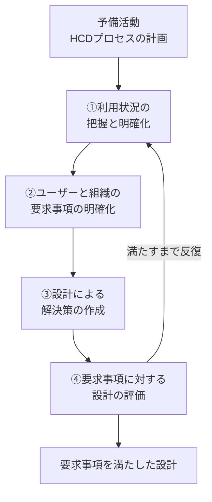

# lesson06: 人間中心デザイン（HCD） — ユーザーを中心に据える設計プロセス

## このレッスンで学ぶこと

- 人間中心デザイン（HCD）の定義と、UXとの関係性を理解する
- HCDの目的とメリットを説明できる
- ISO 9241-210 が示す6つの原則を理解する
- HCDサイクル（1つの予備活動と4つの主要活動）の流れを説明できる
- HCDを実践するうえで欠かせないマインドセットを知る

## 人間中心デザイン（HCD）とは

人間中心デザイン（HCD: Human Centered Design）とは、**ユーザー（製品やサービスを使う人）を中心に据えて設計を進めるアプローチ**です。

国際規格 ISO 9241-210 では、システムの利用に焦点を当て、人間工学やユーザビリティの知識・技法を適用することで、インタラクティブシステムをより使いやすくする設計・開発アプローチと定義されています。

::: tip 「作り手中心」との対比で理解する
HCDの反対は「作り手中心」の設計です。技術やコストの都合、作り手の思い込みを優先するのではなく、**利用者視点**で「誰が・どんな状況で・何を達成したいのか」から出発するのがHCDです。
:::

### HCDとUXの関係性

HCDとUXは「手段と結果」の関係にあります。

| 概念 | 位置づけ |
|------|---------|
| HCD | よいUXを実現するための**プロセス（手段）** |
| UX | 製品・サービスを通じてユーザーに生まれる**体験（結果）** |

UXそのものを直接「作る」ことはできません。HCDのプロセスを回して製品・サービスを改良し、その結果としてよいUXが生まれます。

### HCDの目的・メリット

| 立場 | 目的・メリット |
|------|---------------|
| ユーザー | 使いやすくなり、ストレスなく**目標達成**できる |
| 企業 | 開発の後半で起きる手戻りが減り、開発コストを抑えられる |
| 企業 | 満足度・継続利用が高まり、競争力やブランド価値につながる |

## ISO 9241-210 の6つの原則

ISO 9241-210 は、HCDを実践するための6つの原則を示しています。

1. ユーザー・タスク・環境の明確な理解に基づいて設計する
2. 設計と開発の全体を通じてユーザーが参加する
3. ユーザー中心の評価によって設計を駆動し、改良する
4. プロセスを繰り返す（反復する）
5. UX全体に取り組む（使いやすさだけでなく体験のすべてを対象にする）
6. 学際的なスキルと視点を持つチームで取り組む

::: info 原則が示す3つの柱
6つの原則は「ユーザーの理解と参加（①②）」「評価と反復（③④）」「対象範囲とチーム（⑤⑥）」の3つに整理すると覚えやすくなります。
:::

## HCDサイクル（基本プロセス）

ISO 9241-210 は、HCDの基本プロセスとして**1つの予備活動と4つの主要活動**を定めています。主要活動は一度で終わらせず、要求事項を満たすまで繰り返します。

| 活動 | 内容 |
|------|------|
| 予備活動: HCDプロセスの計画 | 誰が・いつ・どの活動を行うかを計画し、プロジェクトに組み込む |
| ①利用状況の把握と明確化 | ユーザーは誰か、どんな環境・状況で使うかを調査して明らかにする |
| ②ユーザーと組織の要求事項の明確化 | 利用状況をふまえ、ユーザーとビジネス双方の要求を定義する |
| ③設計による解決策の作成 | 要求に応えるデザイン案やプロトタイプを作る |
| ④要求事項に対する設計の評価 | ユーザー視点で評価し、要求を満たすかを確かめる |

評価の代表的な手法には、ユーザーテスト（[lesson28](/lessons/lesson28/)）やエキスパートレビュー（[lesson29](/lessons/lesson29/)）があります。

::: warning 「一度きりの直線」ではない
HCDサイクルの要点は**反復**です。評価で要求を満たさないと分かったら、必要な活動に戻ってやり直します。最初から完璧を目指すのではなく、作って・確かめて・直すことを前提にします。
:::

## HCDのマインドセット

HCDはプロセスを形式的になぞるだけでは機能しません。次のようなマインドセットが土台になります。

- **利用者視点**: 作り手の思い込みではなく、ユーザーの立場から課題と価値を捉える
- **共創**: ユーザーやステークホルダーを設計の早い段階から巻き込み、一緒に作り上げる
- **反復を前提にする**: 一度で正解にたどり着こうとせず、評価と改良を繰り返す

## HCDと関連する概念

| 概念 | 内容 | HCDとの関係 |
|------|------|------------|
| ユニバーサルデザイン | 年齢や能力の違いによらず、できるだけ多くの人が使えるよう最初から設計する考え方（詳細は [lesson15](/lessons/lesson15/)） | 「特定のユーザー」を深く理解するHCDに対し、対象をできるだけ広げる発想 |
| デザインマネジメント | デザインを経営資源と捉え、組織的に活用・推進するマネジメント | HCDを個人の活動で終わらせず、組織に根づかせる枠組み |
| デザイン思考 | デザイナーの思考プロセスを課題解決に応用する考え方（詳細は [lesson07](/lessons/lesson07/)） | ユーザー視点・反復などHCDと共通の発想を持つ |

## キーワード

| 用語 | 説明 |
|------|------|
| 人間中心デザイン（HCD） | ユーザーを中心に据え、使いやすさとよいUXを実現する設計・開発アプローチ |
| 利用者視点 | 作り手の都合ではなく、使う人の立場から考える視点。HCDの出発点 |
| 共創 | ユーザーやステークホルダーと一緒に設計を進めること。ユーザー参加の原則の土台 |
| ISO 9241-210 | HCDの国際規格。6つの原則とHCDサイクルを定める |
| 6つの原則 | ユーザー理解・ユーザー参加・ユーザー中心の評価・反復・UX全体・学際的チーム |
| HCDサイクル | 1つの予備活動（HCDプロセスの計画）と4つの主要活動を反復する基本プロセス |
| 目標達成 | ユーザーが製品・サービスを通じて目的を果たすこと。HCDが目指す成果 |
| ユーザー | 製品・サービスを使う人。HCDが理解と参加の対象とする中心人物 |
| ユニバーサルデザイン | できるだけ多くの人が使えるよう最初から設計する考え方 |
| デザインマネジメント | デザインを経営資源として組織的に活用するマネジメント |

## 試験のポイント

- HCDは**プロセス（手段）**、UXは**体験（結果）**という関係を押さえる
- ISO 9241-210 の6つの原則は、内容の入れ替え問題に備えて6つすべて言えるようにする
- HCDサイクルは「予備活動1つ＋主要活動4つ」という数と、①利用状況の把握→②要求事項の明確化→③解決策の作成→④評価という順番が問われやすい
- 評価で要求を満たさなければ**反復する**点がHCDサイクルの核心
- ユニバーサルデザイン（対象を広げる）とHCD（特定ユーザーを深く理解する）の発想の違いを区別する
