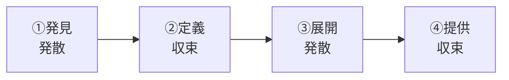

# lesson07: デザイン思考 — デザイナーの思考法で課題を解決する

## このレッスンで学ぶこと

- デザイン思考の考え方と「デザイン」という言葉の本来の意味を理解する
- デザイン思考が必要とされる背景を説明できる
- スタンフォード大学 d.school の5つのステップを理解する
- 英国デザインカウンシルのダブルダイヤモンドを理解する
- デザイン思考と人間中心デザイン（HCD）の関係を整理する

## デザイン思考とは

デザイン思考とは、**デザイナーが実践する思考プロセスを、ビジネスの課題解決に応用する考え方**です。

デザイナーは、ユーザーを観察して共感し、課題を定義し、試作と検証を繰り返しながら答えに近づきます。この進め方を、デザイナーではない人でも使える方法論として整理したものがデザイン思考です。

### 「デザイン」の本来の意味

デザイン思考の「デザイン」は、見た目を飾ることではありません。

| 捉え方 | 意味 |
|--------|------|
| 狭義のデザイン | 色・形・装飾など、見た目（意匠）を整えること |
| 広義のデザイン | 課題を解決するために計画し、**設計**すること |

デザイン思考が使うのは広義のデザインです。**ユーザー視点**に立ち、表面化していない**課題・ニーズの発見**から始める点が核心です。

## デザイン思考が必要とされる背景

デザイン思考が注目される背景には、課題の質の変化があります。

- モノや情報があふれ、機能・性能だけでは差別化しにくくなった
- ユーザー自身も欲しいものを言葉にできず、ニーズが潜在化している
- 市場の変化が速く複雑で、分析だけでは「正解」を導けない問題が増えた

このため、作り手の発想や過去のデータの延長ではなく、ユーザーの観察と共感から課題そのものを発見するアプローチが求められるようになりました。

## 5つのステップ（スタンフォード大学 d.school）

デザイン思考の代表的なプロセスが、スタンフォード大学 d.school の**5つのステップ**です。

| ステップ | 内容 |
|----------|------|
| ①共感（Empathize） | ユーザーを観察・インタビューし、感情や行動の背景を理解する |
| ②問題定義（Define） | 共感で得た気づきから、解くべき課題を定義する |
| ③アイデア創出（Ideate） | 課題を解決するアイデアを量を重視して幅広く出す（手法は [lesson24](/lessons/lesson24/)） |
| ④プロトタイプ（Prototype） | アイデアを素早く形にして、検証できる試作品を作る |
| ⑤テスト（Test） | ユーザーに試してもらい、フィードバックから学ぶ |

::: warning 一方通行のプロセスではない
5つのステップは番号順に一度進めて終わりではありません。テストで得た学びをもとに問題定義へ戻るなど、**行き来しながら繰り返す**ことが前提です。
:::

## ダブルダイヤモンド（英国デザインカウンシル）

英国デザインカウンシルが提唱した**ダブルダイヤモンド**は、デザインのプロセスを「**発散と収束を2回繰り返す**」形で表したモデルです。

| 段階 | 発散/収束 | 内容 |
|------|-----------|------|
| ①発見（Discover） | 発散 | 調査や観察で課題の手がかりを幅広く集める |
| ②定義（Define） | 収束 | 集めた情報を絞り込み、解くべき課題を定める |
| ③展開（Develop） | 発散 | 課題に対する解決アイデアを幅広く出す |
| ④提供（Deliver） | 収束 | アイデアを絞り込み、検証して解決策として仕上げる |

::: tip 2つのダイヤモンドの意味
1つ目のダイヤモンド（発見・定義）は「**正しい課題を見つける**」ため、2つ目（展開・提供）は「**正しい解決策を作る**」ためにあります。いきなり解決策に飛びつかない、という戒めがこの形に込められています。
:::

## デザイン思考とHCDの関係

デザイン思考と人間中心デザイン（HCD、[lesson06](/lessons/lesson06/)）は、よく似た発想を共有しています。

| 観点 | 共通点・違い |
|------|--------------|
| 共通点 | ユーザー視点に立つ。プロトタイプと評価を繰り返す。チームで共創する |
| HCDの特徴 | ISO 9241-210 として規格化された、設計・開発のプロセス |
| デザイン思考の特徴 | 課題の発見やイノベーション創出に重きを置く、思考法・マインドセット |

両者は対立する概念ではありません。デザイン思考で課題とアイデアを見つけ、HCDサイクルで設計と評価を回す、というように補い合う関係です。

## キーワード

| 用語 | 説明 |
|------|------|
| デザイン思考 | デザイナーの思考プロセスをビジネスの課題解決に応用する考え方 |
| デザイン | 本来は「課題解決のための設計」を意味する。見た目の装飾に限らない |
| ユーザー視点 | 作り手ではなくユーザーの立場から課題と価値を捉える視点 |
| 課題・ニーズの発見 | 解決策より先に、解くべき課題や潜在ニーズを見つけ出すこと |
| 5つのステップ | d.school のプロセス。共感→問題定義→アイデア創出→プロトタイプ→テスト |
| 共感（Empathize） | 観察やインタビューでユーザーを深く理解する、5つのステップの起点 |
| ダブルダイヤモンド | 英国デザインカウンシルのモデル。発見→定義→展開→提供の4段階 |
| 発散と収束 | 選択肢を広げる段階と絞り込む段階。ダブルダイヤモンドでは2回繰り返す |

## 試験のポイント

- デザイン思考の「デザイン」は見た目の装飾ではなく**課題解決のための設計**を指す
- 5つのステップは「共感→問題定義→アイデア創出→プロトタイプ→テスト」の順番が頻出。提唱元（スタンフォード大学 d.school）もセットで覚える
- ダブルダイヤモンドは「発見→定義→展開→提供」の4段階と、**発散と収束を2回繰り返す**構造、提唱元（英国デザインカウンシル）を押さえる
- 1つ目のダイヤモンドは「正しい課題を見つける」、2つ目は「正しい解決策を作る」ための過程という対応を整理する
- デザイン思考とHCDはどちらもユーザー視点と反復を重視する点で共通する
