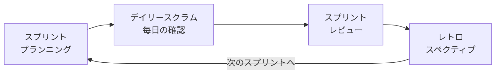

# lesson08: アジャイル開発 — 小さく作り検証を繰り返す

## このレッスンで学ぶこと

- アジャイル開発の考え方と、アジャイルソフトウェア開発宣言の4つの価値を理解する
- ウォーターフォール（従来の開発手法）との違いを説明できる
- スクラムの役割・作成物・イベントを整理して覚える
- XP（ペアプログラミング・テスト駆動開発）とインセプション・デッキを知る
- アジャイル開発とUXデザインの相性を説明できる

## アジャイル開発とは

**アジャイル**（agile）は「俊敏な・機敏な」という意味の言葉です。アジャイル開発とは、**短い期間で「作る→確認する」を繰り返しながら、変化に柔軟に対応して製品を育てていく開発の考え方**です。

最初にすべてを計画し切るのではなく、小さく作って早く見せ、フィードバックから学んで次に活かします。

### アジャイルソフトウェア開発宣言（2001）

2001年に17名のソフトウェア開発者が発表した「アジャイルソフトウェア開発宣言」が、アジャイルの原点です。宣言は**4つの価値**を示しています。

| より価値を置くもの | （比較対象） |
|------|------|
| 個人と対話 | プロセスやツール |
| 動くソフトウェア | 包括的なドキュメント |
| 顧客との協調 | 契約交渉 |
| 変化への対応 | 計画に従うこと |

::: tip 右側を否定しているわけではない
宣言は「左記のことがらにより価値をおく」と述べています。プロセスや計画にも価値を認めたうえで、対話や変化への対応を**より**重視する、という相対的な表現です。
:::

## ウォーターフォールとの違い

従来の代表的な開発手法が**ウォーターフォール**です。要件定義→設計→実装→テストと、滝（waterfall）のように工程を一方向に進めます。

| 観点 | ウォーターフォール | アジャイル |
|------|------|------|
| 進め方 | 工程を順番に1回で進める | 短い反復を何度も繰り返す |
| 計画 | 最初に全体を詳細に計画する | 計画を見直しながら進める |
| 仕様変更 | 後工程での変更コストが大きい | 変化への対応を前提とする |
| 成果の確認 | 完成後にまとめて確認する | 反復のたびに動くものを確認する |
| 向く状況 | 要件が明確で変化が少ない | 要件が不確実で変化が多い |

どちらかが常に優れているわけではありません。「正解がわからない・変化が速い」状況でアジャイルが適する、という使い分けの視点が重要です。

## スクラム

**スクラム**は、アジャイル開発のもっとも代表的なフレームワークです。**スプリント**と呼ばれる短い期間（1〜4週間程度）を繰り返して開発を進めます。

### 3つの役割

| 役割 | 責任 |
|------|------|
| プロダクトオーナー | 製品の価値の最大化に責任を持つ。バックログの優先順位を決める |
| **スクラムマスター** | スクラムが正しく機能するよう支援する。障害を取り除くファシリテーター |
| 開発者 | スプリントごとに製品を作り上げる |

### 3つの作成物

| 作成物 | 内容 |
|------|------|
| プロダクトバックログ | 製品に必要な機能・要望を優先順位を付けて並べた一覧 |
| スプリントバックログ | 今回のスプリントで取り組む項目と作業計画 |
| **インクリメント** | スプリントの成果として完成した「動く製品の増分」 |

### 主なイベント

| イベント | 内容 |
|------|------|
| スプリント | 開発を区切る短い固定期間。この単位で計画と検証を繰り返す |
| デイリースクラム | 毎日同じ時間に行う15分程度の短い確認の場 |
| スプリントレビュー | スプリントの成果（インクリメント）を関係者に見せ、フィードバックを得る場 |
| レトロスペクティブ | スプリントの進め方自体を振り返り、改善点を話し合う場（ふりかえり） |

::: warning レビューとレトロスペクティブの混同に注意
スプリント**レビュー**は「**作ったもの**」を確認する場、**レトロスペクティブ**は「**作り方・チームの進め方**」を振り返る場です。対象の違いを区別して覚えましょう。
:::

## XP（エクストリーム・プログラミング）

**XP**（エクストリーム・プログラミング）は、技術的なプラクティスを重視するアジャイル開発手法です。代表的なプラクティスを2つ覚えましょう。

- **ペアプログラミング**: 2人1組で1つのプログラムを書く。1人が書き、もう1人が確認しながら進めることで品質と知識共有を高める
- **テスト駆動開発**（TDD）: 先にテストを書き、それに通るコードを書く。テスト→実装→改善の小さなサイクルで品質を作り込む

## インセプション・デッキ

**インセプション・デッキ**は、プロジェクト開始時にチームと関係者で目的や前提をすり合わせるためのドキュメントです。「我々はなぜここにいるのか」など10の質問に答える形で作り、目的・範囲・リスクについてチームの認識を最初にそろえます。

## アジャイル開発とUXデザインの相性

アジャイル開発とUXデザインは「**反復しながら検証して学ぶ**」という考え方を共有しています。

- 小さく作って早くユーザーに見せることは、プロトタイピング（[lesson26](/lessons/lesson26/)）やユーザーテスト（[lesson28](/lessons/lesson28/)）と自然につながる
- 人間中心デザイン（HCD）の反復サイクル（[lesson06](/lessons/lesson06/)）やデザイン思考（[lesson07](/lessons/lesson07/)）、リーン開発（[lesson09](/lessons/lesson09/)）とも発想が近い

## キーワード

| 用語 | 説明 |
|------|------|
| アジャイル | 短い反復で作りながら検証し、変化に柔軟に対応する開発の考え方 |
| ウォーターフォール | 要件定義から順に工程を一方向に進める従来型の開発手法 |
| スクラム | スプリントを繰り返すアジャイル開発の代表的フレームワーク |
| スプリント | スクラムにおける短い固定の開発期間（1〜4週間程度） |
| レビュー | スプリントの成果を関係者に見せてフィードバックを得るイベント |
| バックログ | 優先順位付きの作業一覧（プロダクト／スプリントの2種類） |
| インクリメント | スプリントの成果として完成した動く製品の増分 |
| スクラムマスター | スクラムの実践を支援し、チームの障害を取り除く役割 |
| インセプション・デッキ | プロジェクト開始時に目的・前提をすり合わせるドキュメント |
| デイリースクラム | 毎日行う15分程度の短い状況確認の場 |
| レトロスペクティブ | チームの進め方を振り返り改善する「ふりかえり」のイベント |
| ペアプログラミング | 2人1組で1つのプログラムを書くXPのプラクティス |
| テスト駆動開発 | 先にテストを書いてから実装するXPのプラクティス |
| XP | ペアプログラミングやテスト駆動開発などを含むアジャイル開発手法 |

## 試験のポイント

- アジャイルソフトウェア開発宣言（2001）の**4つの価値**は左右の対比（個人と対話／プロセスやツール、など）で覚える
- ウォーターフォールとの違いは「一方向に1回」か「反復を繰り返す」かが軸。仕様変更への強さの違いも問われやすい
- スクラムは**役割3つ・作成物3つ・イベント**をセットで整理する。スプリントレビュー（成果物）とレトロスペクティブ（進め方）の対象の違いは頻出
- ペアプログラミングとテスト駆動開発は**XP**のプラクティス。スクラムの用語と混同しない
- インセプション・デッキは「開始時の認識合わせ」のドキュメントである点を押さえる
