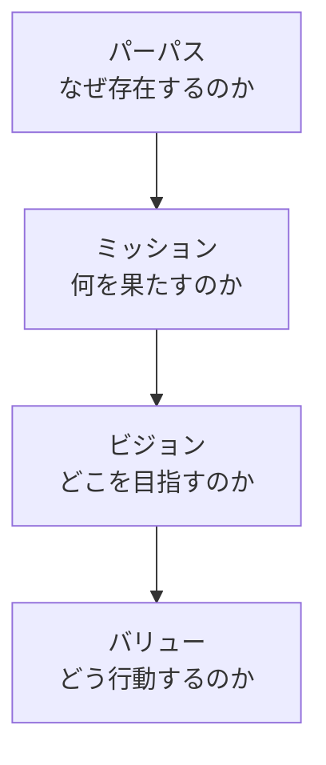

# lesson10: パーパス — 企業の社会的存在意義

## このレッスンで学ぶこと

- パーパスとは何か、企業経営における位置づけを理解する
- ミッション・ビジョン・バリューとの違いと階層関係を整理する
- パーパスが必要とされる背景を説明できる
- パーパスとUXの接点を理解する

## パーパスとは

**パーパス**（purpose）とは、**「この企業は何のために社会に存在するのか」という社会的存在意義**を言葉にしたものです。

- 「何を（What）」「どうやって（How）」の前にある「**なぜ（Why）**」に答える
- 利益の追求だけでなく、社会にどんな価値をもたらす存在なのかを示す
- 経営判断・事業づくり・組織文化の土台となる

::: tip Whyから始める
「何を作るか」より先に「なぜ存在するのか」を定める発想は、サイモン・シネックの「Why（なぜ）から始めよ」という考え方とも重なります。パーパスは企業活動全体のWhyにあたります。
:::

## ミッション・ビジョン・バリューとの関係

パーパスと似た言葉に**ミッション・ビジョン・バリュー**（MVV）があります。それぞれが答える問いの違いで整理しましょう。

| 用語 | 答える問い | 内容 |
|------|------|------|
| パーパス | なぜ存在するのか（Why） | 社会における存在意義 |
| ミッション | 何を果たすのか（What） | 存在意義を踏まえて果たすべき使命・役割 |
| ビジョン | どこを目指すのか（Where） | 実現したい将来の姿・ありたい状態 |
| バリュー | どう行動するのか（How） | 日々の判断・行動の基準となる価値観 |

::: info 階層のとらえ方
パーパスを最上位の「存在意義」に置き、それを具体化したものがミッション・ビジョン・バリューという階層で語られることが一般的です。ただし企業によって定義や順序には揺れがあるため、試験では「それぞれが答える問いの違い」を押さえるのが安全です。
:::

## パーパスが必要とされる背景

なぜ近年、パーパスが注目されるのでしょうか。背景は大きく3つあります。

### 社会課題への意識の高まり

- 気候変動や格差などの社会課題に対し、企業も解決の担い手であることが求められるようになった
- 「儲かるか」だけでなく「社会にとって意味があるか」が企業を評価する軸になった

### 従業員と顧客の共感

- 働く人は給与だけでなく「この仕事は何のためか」という意味を重視するようになった
- 顧客も、機能や価格だけでなく企業の姿勢や価値観に共感して選ぶようになった
- パーパスは、従業員のエンゲージメントと顧客の支持の両方を支える求心力になる

### ESG投資の拡大

- **ESG**（環境・社会・ガバナンス）を重視する投資が拡大した
- 投資家も、社会的存在意義を持ち長期的に価値を生む企業を評価するようになった

## パーパスとUX

パーパスは掲げるだけでは意味がなく、**製品・サービスの体験を通じてユーザーに伝わって初めて機能**します。

- パーパスが描く世界観を、ユーザーとの接点で体現するのがUXデザインの役割
- 体験がパーパスと食い違っていれば、言葉だけの「きれいごと」と受け取られてしまう
- 企業の理念と個々の体験をつなぐ視点は、UXインテリジェンス（[lesson05](/lessons/lesson05/)）の考え方にもつながる

::: warning パーパス・ウォッシュに注意
実態の伴わないパーパスの掲示は、かえって信頼を損ないます。パーパスは宣言ではなく、事業と体験を通じた実践によって証明されるものです。
:::

## キーワード

| 用語 | 説明 |
|------|------|
| パーパス | 企業が「なぜ社会に存在するのか」を示す社会的存在意義（Why） |
| ミッション | 存在意義を踏まえて企業が果たすべき使命・役割（What） |
| ビジョン | 企業が実現したい将来の姿・ありたい状態（Where） |
| バリュー | 日々の判断・行動の基準となる価値観（How） |

## 試験のポイント

- パーパスは「**社会的存在意義（Why）**」。利益目標や事業計画そのものではない点を押さえる
- パーパス・ミッション・ビジョン・バリューは「答える問い（Why／What／Where／How）」の対応で区別できるようにする
- パーパスが必要とされる背景は「社会課題への意識」「従業員と顧客の共感」「ESG投資の拡大」の3点で整理する
- パーパスはUXを通じて体現されて初めて機能する、というUXとの接点も問われうる
