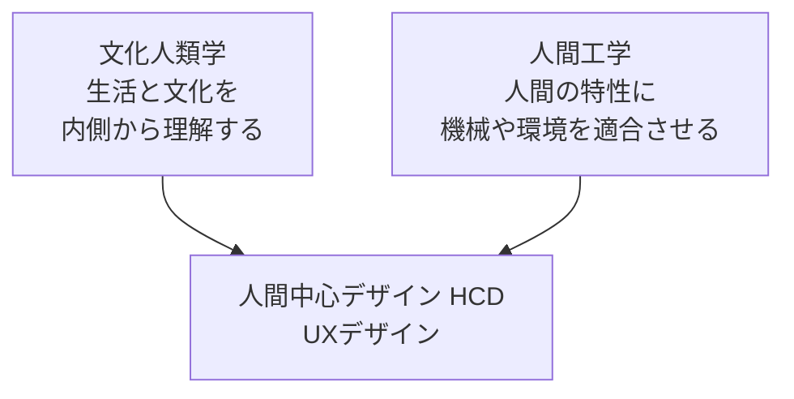

# lesson13: 文化人類学と人間工学 — HCDを支える2つの学問

## このレッスンで学ぶこと

- 文化人類学とは何か、フィールドワークやエスノグラフィーの考え方を理解する
- 文化人類学がUXリサーチ（行動観察・エスノグラフィー）のルーツであることを知る
- 人間工学とは何か、人間特性（身体・知覚）の考え方を理解する
- 2つの学問が人間中心デザイン（HCD）の土台になっていることを説明できる

## 文化人類学と人間工学を学ぶ理由

UXデザインや人間中心デザイン（HCD、詳細は [lesson06](/lessons/lesson06/)）は、ゼロから生まれた方法論ではありません。人間を研究してきた学問の蓄積の上に成り立っています。

- **文化人類学**: 「人を深く理解する」方法の源流
- **人間工学**: 「人に合わせて設計する」考え方の源流

## 文化人類学とUXデザイン

### 文化人類学とは

文化人類学とは、人々の生活・文化・価値観を、**その人たちの内側の視点から理解しようとする学問**です。代表的な調査の方法が次の2つです。

| 用語 | 意味 |
|------|------|
| フィールドワーク | 対象となる人々の生活の場に入り込み、ともに過ごしながら観察する調査方法 |
| エスノグラフィー | フィールドワークを通じて人々の暮らしや文化を記述する手法、またはその記録 |

研究者は自分の常識をいったん脇に置き、現地の文脈の中で「なぜそう行動するのか」を理解しようとします。

### UXリサーチとのつながり

この姿勢と手法は、UXリサーチに直接受け継がれています。

- ユーザー本人も言葉にできないニーズは、アンケートやインタビューだけでは見えないことがある
- 実際の利用現場に出向いて観察する**行動観察・エスノグラフィー**（詳細は [lesson20](/lessons/lesson20/)）は、文化人類学にルーツを持つ
- 「作り手の思い込みを持ち込まず、ユーザーの文脈で理解する」姿勢は、HCDの「利用状況の理解」に通じる

::: tip 例: 観察だからわかること
「説明書を読んでから使いますか」と聞けば多くの人が「読む」と答えます。しかし家庭での様子を観察すると、説明書を読まずに使い始め、つまずいてから検索する人が多いとわかります。発言と行動のずれをとらえられるのが、観察に基づくリサーチの強みです。
:::

## 人間工学とUXデザイン

### 人間工学とは

人間工学（エルゴノミクス）とは、**人間の身体特性や知覚特性に合わせて、機械・道具・環境を設計する学問**です。

- 「人を機械に合わせて訓練する」のではなく、「機械を人に合わせて設計する」という方向性を持つ
- この方向性は、HCDの「人間を中心に据える」という考え方の原点の1つ

### 人間特性

人間工学が扱う**人間特性**とは、人間が生まれつき持っている心身の性質や限界のことです。代表的なものに**身体**や**知覚**の特性があり、ほかに反応時間やエラー特性なども含まれます。

| 人間特性 | 内容 | 設計への影響の例 |
|----------|------|------------------|
| 身体（身体寸法・筋力） | 手の大きさ・届く範囲・力の強さには限界と個人差がある | ボタンの大きさと間隔、片手で届く位置への配置 |
| 知覚（視野・視力・色覚・聴覚） | 一度に見える範囲や識別できる色・音には限界と個人差がある | 文字サイズ、十分なコントラスト、色だけに頼らない表示 |
| 反応時間 | 刺激を受けてから反応するまでに時間がかかる | 操作への即時フィードバック、余裕のある制限時間 |
| エラー特性 | 人は注意していても必ず間違える | 取り消し機能、確認画面、誤操作しにくいレイアウト |

::: info ユーザビリティ指針との関係
こうした人間特性の知見は、ユーザビリティ（詳細は [lesson14](/lessons/lesson14/)）やアクセシビリティ（詳細は [lesson15](/lessons/lesson15/)）の設計指針の根拠になっています。「タップ領域は十分な大きさにする」「色だけで情報を伝えない」といった指針は、人間特性から導かれたものです。
:::

## HCDの土台としての2つの学問

2つの学問は、HCDとUXデザインに異なる角度から貢献しています。

| 学問 | 中心となる問い | HCD・UXデザインへの貢献 |
|------|----------------|--------------------------|
| 文化人類学 | 人々はどんな文脈・文化の中で生きているか | ユーザーを深く理解する方法（フィールドワーク・エスノグラフィー・行動観察） |
| 人間工学 | 人間の心身はどんな特性と限界を持つか | 人間特性に基づく設計指針（ユーザビリティ・アクセシビリティの基礎） |

言いかえると、文化人類学は「**理解の方法**」を、人間工学は「**適合の指針**」をHCDに提供しています。どちらも「人間を出発点にする」という点で共通しており、HCDの土台と呼べる学問です。

## キーワード

| 用語 | 説明 |
|------|------|
| 文化人類学 | 人々の生活・文化を内側の視点から理解しようとする学問。UXリサーチのルーツ |
| フィールドワーク | 対象の生活の場に入り込んで観察する調査方法 |
| エスノグラフィー | フィールドワークによって人々の暮らしを記述する手法・記録 |
| 行動観察 | 利用現場でユーザーの実際の行動を観察するUXリサーチの手法 |
| 人間工学（エルゴノミクス） | 人間の特性に機械・道具・環境を適合させる学問 |
| 人間特性 | 人間が持つ心身の性質や限界。身体と知覚の特性を含む |
| 身体 | 身体寸法・筋力など、身体面の人間特性 |
| 知覚 | 視野・視力・色覚・聴覚など、感覚面の人間特性 |

## 試験のポイント

- 文化人類学は「**内側の視点から理解する**」学問で、エスノグラフィー・フィールドワークがUXリサーチ（行動観察）のルーツである点を押さえる
- 人間工学は「人を機械に合わせる」のではなく「**機械や環境を人に合わせる**」学問という方向性が問われやすい
- 重要ワードの**人間特性・身体・知覚**は、人間工学の文脈で出題される。具体例（視野・反応時間・エラー特性など）と結びつけて覚える
- 人間特性の知見がユーザビリティやアクセシビリティの指針の根拠になっている、というつながりを説明できるようにする
- 2つの学問がHCD・UXデザインの土台である、という位置づけを整理しておく
