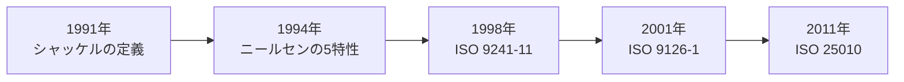

# lesson14: ユーザビリティ — 定義の変遷と構成要素

## このレッスンで学ぶこと

- ユーザビリティが「使いやすさ」を測る尺度であることを理解する
- 定義の変遷（シャッケル→ニールセン→ISO 9241-11→ISO 9126-1→ISO 25010）を時系列で整理する
- ISO 9241-11 の定義の核心である「特定のユーザーが特定の利用状況で」という文脈依存性を理解する
- ユーザビリティ向上で重要な視点と、UXとの違いを説明できる

## ユーザビリティとは

ユーザビリティ（Usability）とは、製品やサービスの**使いやすさを測る尺度**です。

「使いやすさ」と聞くと、ユーザーへの細やかな配慮や思いやりを連想しがちです。しかし出発点はもっと根本的で、まず「**使えるかどうか**」が問われます。

::: warning 「ユーザビリティに問題がある」とは
単に「少し不便」という意味ではありません。ユーザーが目標を達成できない、つまり「使えない」状態を含む深刻な問題を指すことがあります。
:::

たとえば昼休みで混雑し始めた飲食店の食券機を考えます。近くで働く会社員（特定のユーザー）が、急いで食券を買う（特定の目標）という状況で、迷わず購入できるか、短時間で済むか、不快感がないか。この度合いがユーザビリティです。

## ユーザビリティ定義の変遷

ユーザビリティの定義は、研究者の提唱から国際規格へと段階的に発展してきました。試験対策では、この時系列を押さえることが重要です。

### シャッケルの定義（1991年）

ブライアン・シャッケルは、製品が受け入れられるかどうかを、次の3つの要素とコストとの比較で説明しました。

| 要素 | 意味 |
|------|------|
| ユーティリティ（Utility） | 役に立つか（機能がニーズに合っているか） |
| ユーザビリティ（Usability） | 使えるか（うまく操作できるか） |
| ライカビリティ（Likability） | 好ましいか（感情的に受け入れられるか） |

コストに対してこれら3要素の比率が高い製品ほど、ユーザーにとって購入する価値が高いという考え方です。ユーザビリティを「役立ち」や「好ましさ」と区別して位置づけた点が特徴です。

### ニールセンの5つの特性（1994年）

ヤコブ・ニールセンは、ユーザビリティを5つの特性に分解しました。ユーザビリティ工学の基礎概念となった定義です。

| 特性 | 意味 |
|------|------|
| 学習しやすさ | 初めてでも簡単に使い方を覚えられるか |
| 効率性 | 一度覚えれば高い生産性で作業できるか |
| 記憶しやすさ | しばらく使わなくても、再び使うときに思い出せるか |
| 間違いにくさ | エラーが起きにくく、起きても回復できるか |
| 主観的満足度 | 使っていて心地よく、満足できるか |

### ISO 9241-11 の定義

国際規格 ISO 9241-11 は、ユーザビリティを次のように定義しています（1998年に制定され、2018年に改訂）。現行の定義は日本産業規格 JIS Z 8521（2020年）にも引き継がれており、この教材全体でも基準にしています。

> 特定のユーザーが特定の利用状況において、システム・製品・サービスを利用する際に、有効さ・効率・満足度を伴って特定の目標を達成する度合い

| 構成要素 | 意味 |
|----------|------|
| 有効さ | やりたいことが正確に、完全にできるか |
| 効率 | 達成のために費やす資源（時間・労力）が少なくて済むか |
| 満足度 | 不快感がなく、ニーズや期待が満たされているか |

::: tip この定義の肝は「文脈依存性」
ユーザビリティは製品単体の性質ではなく、「**誰が・どんな状況で・何のために**」使うかで変わる相対的な度合いです。同じ食券機でも、毎日使う常連客と初めて訪れた観光客とではユーザビリティは異なります。
:::

### ISO 9126-1 の定義（2001年）

ISO 9126-1 は**ソフトウェア品質**の規格です。ユーザビリティ（使用性）を、機能性や信頼性などと並ぶソフトウェアの品質特性の1つとして定義しました。

あわせて「利用時の品質」という概念を導入し、開発したソフトウェア自体の品質と、実際に使われたときの品質を分けて捉える土台を作りました。

### ISO 25010 の定義（2011年）

ISO 25010（SQuaRE）は ISO 9126 を引き継いだ規格で、品質を2つのモデルに整理しました。

| モデル | 内容 |
|--------|------|
| 製品品質モデル | 製品・システム自体が持つ品質。使用性（ユーザビリティ）を含む特性群で構成 |
| 利用品質モデル | ユーザーが実際に利用したときに生じる品質。有効性・効率性・満足性などで構成 |

製品品質は利用品質に影響を与える関係にあります。「製品に作り込んだ品質」が、利用状況の中で「ユーザーが得る品質」として現れるという捉え方です。

## ユーザビリティ向上で重要な視点

ユーザビリティの改善には優先順位があります。まず「使えない」を解消し、次に労力を減らし、最後に不満をなくすという順序です。

1. 有効さの確保（使える、使い方がわかる）
2. 効率の改善（労力なく使える）
3. 満足度の向上（不満なく使える）

これらは「マイナス要因の克服」です。一方で、愛着や審美的な印象といった「使いたくなる」プラス要因の提案は、ユーザビリティを超えてUX全体の領域に入ります。

### UXとの違い

ユーザビリティは**UXの一部**です。UXの全体像は [lesson01](/lessons/lesson01/) で学んだとおり、利用前の期待から利用後の振り返りまでを含みます。

- ユーザビリティ: 特定の利用状況での「目標達成のしやすさ」に焦点を当てる
- UX: 使いやすさを含む、知覚・感情・体験のすべてを対象にする

使いやすくても体験全体がよいとは限りません。なお、ユーザビリティの評価方法は [lesson28](/lessons/lesson28/) と [lesson29](/lessons/lesson29/) で扱います。

## キーワード

| 用語 | 説明 |
|------|------|
| ユーザビリティ | 製品・サービスの使いやすさを測る尺度。特定のユーザーが特定の利用状況で目標を達成する度合い |
| シャッケルの定義 | ユーティリティ・ユーザビリティ・ライカビリティの3要素とコストの比較で製品の受容を説明（1991年） |
| ニールセンの5特性 | 学習しやすさ・効率性・記憶しやすさ・間違いにくさ・主観的満足度（1994年） |
| ISO 9241-11 | 有効さ・効率・満足度でユーザビリティを定義した国際規格（1998年）。JIS Z 8521 に対応 |
| ISO 9126-1 | ソフトウェア品質の規格（2001年）。利用時の品質という概念を導入 |
| ISO 25010 | 製品品質モデルと利用品質モデルを定めた規格（SQuaRE、2011年） |

## 試験のポイント

- 定義の変遷の順序が問われやすい。**シャッケル（1991）→ニールセン（1994）→ISO 9241-11（1998）→ISO 9126-1（2001）→ISO 25010（2011）**の流れを覚える
- シャッケルの3要素（ユーティリティ・ユーザビリティ・ライカビリティ）と、ニールセンの5特性を混同しない
- ISO 9241-11 の3要素は**有効さ・効率・満足度**。「特定のユーザーが特定の利用状況で」という文脈依存性とセットで覚える
- ISO 9126-1 は**ソフトウェア品質**、ISO 25010 は**製品品質と利用品質の2モデル**という対応を整理する
- ユーザビリティはUXの一部であり、UXそのものではない点は頻出
