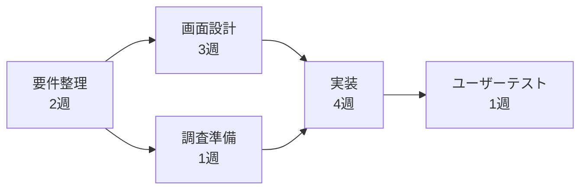

# lesson16: プロジェクトマネジメント — 計画と役割分担で完遂する

## このレッスンで学ぶこと

- プロジェクトの定義（有期性・独自性）と定常業務との違いを理解する
- PMBOKが何のための知識体系かを知り、QCDのバランスという考え方を理解する
- WBSとクリティカルパスを使った計画づくりの基本を理解する
- プロジェクトマネージャーとPMOの役割の違いを説明できる
- UXの活動（リサーチ・評価）をプロジェクト計画にどう組み込むかを知る

## プロジェクトとは

プロジェクトとは、**独自の成果物を生み出すために行われる、始まりと終わりのある活動**です。次の2つの性質を持つ点が定義の核心です。

| 性質 | 意味 |
|------|------|
| 有期性 | 明確な開始と終了がある。期限が来れば（または目標を達成すれば）終わる |
| 独自性 | 生み出す成果物やサービスが毎回異なる。同じことの繰り返しではない |

毎月の経理処理のような**定常業務（ルーチンワーク）**は、繰り返し続く点でプロジェクトとは区別されます。「新しいアプリを来年3月までにリリースする」のように、独自の目標と期限がある活動がプロジェクトです。

::: info プロジェクトマネジメントとは
プロジェクトを成功させるための計画・実行・監視・調整の活動全般をプロジェクトマネジメントと呼びます。属人的な経験や勘に頼らず、体系化された知識を使うことが重視されます。
:::

## PMBOK（知識体系）

**PMBOK**（Project Management Body of Knowledge）は、プロジェクトマネジメントの**知識体系**です。米国のPMI（プロジェクトマネジメント協会）がまとめており、世界的な事実上の標準として使われています。

プロジェクトマネジメントで広く意識されるのが**QCDのバランス**です。

| 要素 | 内容 |
|------|------|
| Q（Quality、品質） | 成果物が求められる水準を満たしているか |
| C（Cost、コスト） | 予算内に収まっているか |
| D（Delivery、納期） | 期限までに完成するか |

QCDは互いにトレードオフの関係にあります。たとえば納期を縮めれば品質が下がるかコストが増えるため、3つすべてを同時に理想の水準へ引き上げるのは難しく、状況に応じてバランスを取ることが求められます。

## 計画づくりの道具

### WBS（作業分解）

**WBS**（Work Breakdown Structure）は、プロジェクトの全作業を**階層的に分解して洗い出す**手法です。大きな成果物から始めて、見積もりや担当割り当てができる粒度のタスクまで細かくしていきます。

- 全体像を漏れなく把握できる（やるべき作業の抜けを防ぐ）
- タスクごとに担当者・工数・期間を割り当てられる
- スケジュール表（ガントチャートなど）を作る土台になる

たとえば「アプリのリリース」なら、「調査」「設計」「実装」「テスト」に分け、「調査」をさらに「インタビュー準備」「実査」「分析」に分ける、という要領です。

### クリティカルパス

**クリティカルパス**は、タスクの依存関係をつないだ経路のうち、**所要時間がもっとも長い経路**のことです。この最長経路の長さが、プロジェクト全体の工期を決めます。

上の例では「要件整理→画面設計→実装→ユーザーテスト」の経路が合計10週でもっとも長く、これがクリティカルパスです。「調査準備」を急いでも全体は短くなりません。

::: tip クリティカルパスを見る理由
クリティカルパス上のタスクが1日遅れると、プロジェクト全体が1日遅れます。逆に工期を縮めたいときも、クリティカルパス上のタスクを短縮しなければ効果がありません。
:::

## プロジェクトに関わる役割

### プロジェクトマネージャーとPMO

| 役割 | 内容 |
|------|------|
| プロジェクトマネージャー（PM） | **個別のプロジェクト**の責任者。計画立案、進捗・品質・コストの管理、ステークホルダーとの調整を行う |
| PMO（Project Management Office） | **組織横断**でプロジェクトマネジメントを支援する部門・チーム。標準的な手法やルールの整備、複数プロジェクトの状況の取りまとめ、PMの支援を行う |

PMが「1つのプロジェクトを成功させる」役割なのに対し、PMOは「組織のプロジェクト全体がうまく回る仕組みをつくる」役割です。両者の違いは試験でも問われやすいポイントです。

::: info そのほかのステークホルダー
プロジェクトには、発注者・スポンサー（予算の責任者）・開発メンバー・デザイナー・エンドユーザーなど多様なステークホルダー（利害関係者）が関わります。PMには、それぞれの期待を把握して調整する役割が求められます。
:::

## UXプロジェクトでの位置づけ

UXデザインを伴うプロジェクトでは、通常の開発作業に加えて**リサーチや評価の工程を計画に組み込む**必要があります。

- ユーザー調査（[lesson18](/lessons/lesson18/)）には、対象者の募集（リクルーティング）や日程調整の期間が必要になる
- ユーザーテスト（[lesson28](/lessons/lesson28/)）は、結果を反映する修正期間とセットで計画する
- 調査や評価を「時間が余ったらやる」扱いにすると、真っ先に削られてしまう。WBSの段階で明示的にタスクとして組み込む

また、計画を最初に固めて一方向に進めるウォーターフォール型に対し、短い反復で作りながら学ぶアジャイル開発（[lesson08](/lessons/lesson08/)）では、計画の立て方や見直しの頻度が大きく異なります。UXの活動はどちらの進め方とも組み合わせられますが、不確実性が高いテーマでは反復型との相性がよいとされます。

## キーワード

| 用語 | 説明 |
|------|------|
| プロジェクト | 独自の成果物を生み出す、始まりと終わりのある活動。有期性と独自性が特徴 |
| PMBOK | PMIがまとめたプロジェクトマネジメントの知識体系。世界的な事実上の標準 |
| QCD | 品質（Quality）・コスト（Cost）・納期（Delivery）。トレードオフのバランスを取る |
| WBS | プロジェクトの全作業を階層的に分解して洗い出す手法（Work Breakdown Structure） |
| クリティカルパス | 依存関係でつながるタスクの経路のうち最長のもの。全体の工期を決める |
| プロジェクトマネージャー | 個別のプロジェクトの計画・進捗・調整に責任を持つ役割 |
| PMO | 組織横断でプロジェクトマネジメントを標準化・支援する部門（Project Management Office） |

## 試験のポイント

- プロジェクトの定義は「**有期性**」と「**独自性**」の2つ。定常業務（繰り返しの業務）との違いで問われやすい
- PMBOKは「知識体系」であり、特定のツールや資格そのものではない。QCDの3要素とトレードオフの関係を覚える
- WBSは「作業を階層的に分解する手法」、クリティカルパスは「**最長経路**が全体工期を決める」という点を正確に押さえる
- プロジェクトマネージャー（個別プロジェクトの責任者）とPMO（組織横断の支援部門）の役割の違いは頻出
- UXプロジェクトでは、リサーチ・評価の工程を計画段階からWBSに組み込むことが重要
