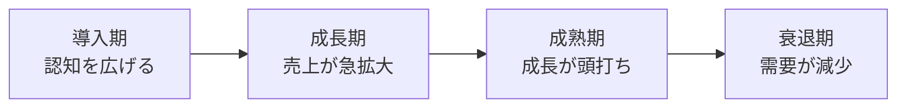
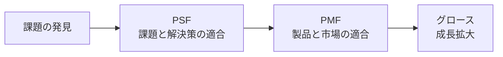

# lesson17: プロダクトマネジメント — 製品を継続的に育てる

## このレッスンで学ぶこと

- プロジェクト（有期）とプロダクト（継続）の違いを理解する
- プロダクトライフサイクルの4つの段階を覚える
- プロダクトポートフォリオ（PPM）の4象限を理解する
- PSFとPMFの意味と順序（PSF→PMF）を説明できる
- 品質管理の考え方と、プロダクトマネージャーとUXの関係を知る

## プロジェクトとプロダクトの違い

[lesson16](/lessons/lesson16/) で学んだプロジェクトは、期限が来れば終わる**有期**の活動でした。一方、プロダクト（製品・サービス）は、リリースして終わりではなく**市場で使われ続ける限り改善が続く**存在です。

| 観点 | プロジェクトマネジメント | プロダクトマネジメント |
|------|------|------|
| 期間 | 有期（開始と終了がある） | 継続（市場から撤退するまで続く） |
| ゴール | 期限内に成果物を完成させる | 製品の価値と事業成果を最大化する |
| 問い | 「正しく作れているか」 | 「正しいものを作っているか」 |
| 代表的な役割 | プロジェクトマネージャー | プロダクトマネージャー |

プロダクトマネジメントとは、**何を作るべきかを決め、製品をライフサイクル全体にわたって育てていく活動**です。リリースは終わりではなく、改善の始まりです。

## プロダクトライフサイクル

**プロダクトライフサイクル**は、製品が市場に登場してから撤退するまでを**4つの段階**で捉えるモデルです。

| 段階 | 状況 | 打ち手の例 |
|------|------|-----------|
| 導入期 | 認知度が低く、売上は小さい | 認知拡大、初期ユーザーの獲得 |
| 成長期 | 売上が急拡大し、競合も増える | 機能拡充、シェアの獲得 |
| 成熟期 | 市場が飽和し、成長が頭打ちになる | 差別化、既存ユーザーの維持 |
| 衰退期 | 需要が減り、売上が低下する | 撤退の判断、次の製品への移行 |

段階によって取るべき戦略が変わるため、自社の製品が今どの段階にあるかを見極めることが重要です。

## プロダクトポートフォリオ（PPM）

**プロダクトポートフォリオ・マネジメント（PPM）**は、複数の製品・事業を**市場成長率**と**相対的な市場シェア**の2軸で整理し、資源配分を考える手法です。ボストン・コンサルティング・グループが提唱しました。

| 象限 | 市場成長率 | 市場シェア | 特徴 |
|------|------|------|------|
| 花形（スター） | 高い | 高い | 売上は大きいが投資も必要。将来の柱候補 |
| 金のなる木 | 低い | 高い | 安定した収益源。ここで得た資金を他に回す |
| 問題児 | 高い | 低い | 成長市場だがシェアが低い。投資して花形に育てるか見極める |
| 負け犬 | 低い | 低い | 撤退・縮小を検討する |

::: tip 資金の流れで覚える
「金のなる木」で稼いだ資金を「問題児」に投資して「花形」に育てる、というのがPPMの基本的な考え方です。各象限の名前と2軸の高低の組み合わせを正確に覚えましょう。
:::

## PSFとPMF（適合の2段階）

新しいプロダクトが成功するまでには、2つの「適合（フィット）」を順番に達成する必要があるとされます。

| 用語 | 意味 | 確かめること |
|------|------|------|
| PSF（Problem Solution Fit） | **課題と解決策の適合**。想定した課題が本当に存在し、その解決策が課題を解決できている状態 | その課題は本当にあるか。解決策は課題に効くか |
| PMF（Product Market Fit） | **製品と市場の適合**。製品が市場に受け入れられ、求められている状態 | 製品を求める市場（顧客）が十分にいるか |

順序が重要です。**PSFが先、PMFが後**です。課題と解決策が噛み合っていないまま市場に出しても受け入れられないため、まずPSFを検証し、そのうえでPMFを目指します。小さく作って検証を繰り返す進め方は、リーン開発（[lesson09](/lessons/lesson09/)）の考え方とも深く関わります。

## 品質管理

**品質管理**は、製品の品質を**計画し、検証し、維持・改善し続ける**活動です。プロダクトは継続して使われるため、リリース時の品質だけでなく、運用中の品質を保ち続けることが求められます。

- 品質の基準を決める（何をもって「よい」とするかを定義する）
- 基準を満たしているかを検証する（テスト・レビュー・ユーザーの声の収集）
- 問題を見つけたら改善し、再発を防ぐ

品質には、機能が正しく動くことだけでなく、使いやすさ（ユーザビリティ）も含まれます。ソフトウェア品質の国際規格と品質の捉え方は [lesson14](/lessons/lesson14/) で扱っています。

## プロダクトマネージャーとUX

プロダクトマネージャー（PdM）は、**ビジネス・技術・UX**の3つの領域が重なる位置に立ち、「何を作るべきか」の意思決定に責任を持つ役割です。

- ユーザーの課題を理解する（UXリサーチの結果を意思決定に使う）
- 事業として成立させる（収益・コスト・市場の視点を持つ）
- 技術的な実現性をエンジニアと検討する

ユーザー理解なしに「何を作るべきか」は決められないため、PdMにとってUXの知識と実践は中核的なスキルです。ユーザーの成功体験を起点に事業を成長させる考え方は、UXグロース（[lesson04](/lessons/lesson04/)）にもつながります。

## キーワード

| 用語 | 説明 |
|------|------|
| プロダクトマネジメント | 何を作るべきかを決め、製品をライフサイクル全体で継続的に育てる活動 |
| プロダクトライフサイクル | 製品の一生を導入期・成長期・成熟期・衰退期の4段階で捉えるモデル |
| プロダクトポートフォリオ | 市場成長率と市場シェアの2軸で製品・事業を整理する手法（PPM）。花形・金のなる木・問題児・負け犬の4象限 |
| PSF | Problem Solution Fit。課題と解決策が適合している状態。PMFより先に達成する |
| PMF | Product Market Fit。製品が市場に受け入れられ、求められている状態 |
| 品質管理 | 品質の基準を定め、検証し、維持・改善し続ける活動 |
| プロダクトマネージャー | ビジネス・技術・UXの交差点で「何を作るべきか」に責任を持つ役割 |

## 試験のポイント

- プロジェクトは**有期**、プロダクトは**継続**。この対比は [lesson16](/lessons/lesson16/) とセットで問われやすい
- プロダクトライフサイクルの4段階（導入期・成長期・成熟期・衰退期）の順番と各段階の特徴を覚える
- PPMの4象限は、2軸（市場成長率・市場シェア）の高低と名前の対応で問われる。「金のなる木」は成長率が低くシェアが高い、と正確に
- **PSF→PMFの順序**は頻出。PSFは「課題と解決策」、PMFは「製品と市場」の適合という対応を取り違えない
- 品質管理はリリース時だけでなく、運用中も継続する活動である点を押さえる
