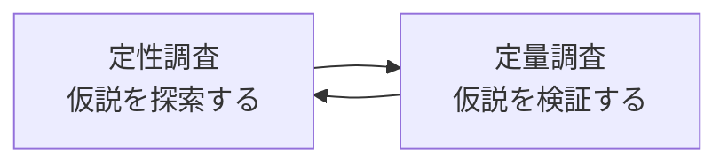

# lesson18: UXリサーチの全体像 — データの2軸と手法の選び方

## このレッスンで学ぶこと

- UXデザインでなぜリサーチが必要なのかを説明できる
- ユーザーデータを「質的/量的」「意識/行動」の2軸で整理できる
- 調査目的（探索か検証か）に応じて適切な手法を選択できる
- 一般的なマーケティングリサーチとデザインリサーチの違いを理解する

## なぜリサーチが必要か

UXデザインは、作り手の思い込みではなく**ユーザーの事実**から出発します。リサーチとは、ユーザーに関するデータを集めて理解するための活動全般を指します。

「優れた製品は直感から生まれるからリサーチは不要だ」という意見もあります。しかし実際には、革新的とされる企業でも、ユーザーの観察や調査は形を変えて行われています。

::: info リサーチの量とアイデアの質
情報量が飽和するまでの範囲では、リサーチで得た情報が増えるほどアイデアの質は高まる傾向があるとされます。リサーチは創造性の敵ではなく、むしろ土台です。
:::

### 「知る」だけでは不十分

リサーチの目的は、事実を集めること自体ではありません。集めた事実を構造的に整理して意味づけ、デザインや事業の判断に活かせる**インサイト**（人を動かす隠れた心理、洞察）を得ることがゴールです。

- インサイトは戦略・要件・設計・デザインの「根拠」になる
- 個別の事実への反射的な対応ではなく、背景にある構造を読み解く
- 例: 「ある時期にある商品が売れる」という事実の背景に「縁起担ぎ」という心理を見いだす

## ユーザーデータの2軸整理

ユーザーに関するデータは、次の2つの軸で整理すると見通しがよくなります。

| 軸 | 一方 | もう一方 |
|----|------|---------|
| データの性質 | **質的データ**（言葉・観察記録など数値化しにくい情報） | **量的データ**（数値として集計・比較できる情報） |
| データの源泉 | **意識データ**（ユーザーが「言うこと」。意見・回答） | **行動データ**（ユーザーが「すること」。操作・移動の記録） |

2軸を掛け合わせると、代表的な手法は次のように位置づけられます。

| | 質的データ | 量的データ |
|---|-----------|-----------|
| **意識データ** | インタビュー | アンケート（質問紙調査） |
| **行動データ** | ユーザー観察・エスノグラフィー | アクセスログ分析・A/Bテスト |

::: warning 発言と行動は一致しない
ユーザーの発言（意識データ）と実際の行動（行動データ）には隔たりがあります。「使いたい」と答えた人が実際には使わないことは珍しくありません。意識データと行動データの両方を見ることが重要です。
:::

## 目的に応じた手法の選択

手法を選ぶ起点は「何のために調べるのか」です。リサーチの目的は大きく**仮説探索**と**仮説検証**に分けられます。

| 目的 | 内容 | 向くアプローチ | 代表的な手法 |
|------|------|----------------|--------------|
| 仮説探索 | 新しい気づきを得て、仮説を作り上げる | 定性調査 | インタビュー、ユーザー観察、エスノグラフィー |
| 仮説検証 | 分かっていることを確かめる | 定量調査 | アンケート、A/Bテスト、アクセスログ分析 |

どちらか一方で終わりにせず、「探索で仮説を作り、検証で確かめる」を繰り返すことが重要です。なお、どんなリサーチも何らかの先入観（仮説）を持って臨む以上、探索と検証の区別は厳密なものではありません。

## マーケティングリサーチとデザインリサーチ

近年のUXリサーチのトレンドが**デザインリサーチ**です。一般的なマーケティングリサーチとの違いは次のように整理されます。

| 観点 | 一般的なマーケティングリサーチ | デザインリサーチ（UXリサーチ） |
|------|------------------------------|------------------------------|
| 調査目的 | 知るための調査（仮説検証型） | つくるための調査（仮説探索型・インスピレーション獲得） |
| 調査スタイル | 制御された環境での調査 | 現場（実際の利用文脈）での調査 |
| 調査対象者 | 典型的なユーザーを大規模にサンプリング | エクストリームユーザーなど少数精鋭 |
| 調査の価値 | 結果の一般性（統計的な代表性） | 解決策のヒントが得られたか |

デザインリサーチは特定の手法名ではなく、「結果をデザインに活かす」という調査時のマインドセットを指します。エスノグラフィーやインタビューなどの定性調査と相性がよい一方、アンケートでもデザインリサーチは可能です。

## UXリサーチの学習マップ

リサーチの各アプローチは、それぞれ次のレッスンで詳しく学びます。

| レッスン | テーマ | 主に扱うデータ |
|----------|--------|----------------|
| [lesson19](/lessons/lesson19/) | 定量調査 | 量的データ（主に意識データ） |
| [lesson20](/lessons/lesson20/) | 定性調査 | 質的データ（意識データと行動データ） |
| [lesson21](/lessons/lesson21/) | 行動データ分析 | 量的データ（行動データ） |

## キーワード

| 用語 | 説明 |
|------|------|
| UXリサーチ | ユーザーの事実を集めて理解し、UXデザインの根拠とする調査活動の総称 |
| デザインリサーチ | つくるための調査。仮説探索やインスピレーション獲得を重視するマインドセット |
| 質的データ | 言葉や観察記録など、数値化しにくいデータ。定性調査で得られる |
| 量的データ | 数値として集計・比較できるデータ。定量調査で得られる |
| 意識データ | ユーザーの発言・回答から得られる、意見や認識のデータ |
| 行動データ | ユーザーの実際の行動の記録。発言とのずれを補正できる |
| インサイト | 事実を構造的に整理して意味づけた、人を動かす隠れた心理・洞察 |
| 仮説探索 / 仮説検証 | 新しい気づきから仮説を作ること / 既存の仮説を確かめること |

## 試験のポイント

- 「質的/量的」「意識/行動」の2軸と、各象限の代表手法（インタビュー・アンケート・観察・ログ分析）の対応を覚える
- 探索なら定性、検証なら定量という目的と手法の基本的な対応を押さえる
- マーケティングリサーチ（仮説検証型・知るための調査）とデザインリサーチ（仮説探索型・つくるための調査）の対比は頻出
- ユーザーの発言（意識データ）と行動（行動データ）は一致するとは限らない、という前提を理解しておく
- デザインリサーチは特定の手法ではなく、デザインに活かすためのマインドセットである点に注意する
