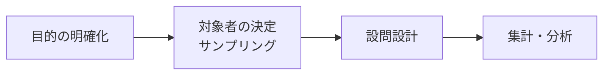

# lesson19: 定量調査 — アンケートでユーザーを数値で捉える

## このレッスンで学ぶこと

- 定量調査の特徴と、UXリサーチにおける役割を理解する
- アンケート調査の設計プロセス（目的→対象者→設問設計→集計・分析）を理解する
- 設問形式（プリコード法・自由回答法、SA・MA）の違いと使い分けを知る
- クロス集計の考え方と、設問設計で避けるべき落とし穴を知る

## 定量調査とは

**定量調査**とは、ユーザーの思考や行動を**数値として量的に把握する**調査手法です。代表的な手法が**アンケート**です。

- 「何人が」「何割が」「どのくらい」を数値で示せる
- 多くの人から回答を集めることで、全体の傾向を客観的に捉えられる
- 数値で示せるため、関係者への説明や意思決定の根拠にしやすい

一方で、「なぜそう答えたのか」という理由や背景までは分かりにくい限界があります。理由や文脈を深く知るには、インタビューなどの定性調査（[lesson20](/lessons/lesson20/)）を組み合わせます。

## アンケート調査の設計プロセス

アンケートは「聞きたいことをとりあえず並べる」のではなく、次の流れで設計します。

### 1. 目的の明確化

「この調査で何を明らかにし、どんな意思決定に使うのか」を最初に決めます。目的があいまいなまま設問を作ると、集計しても使えないデータになりがちです。

### 2. 対象者の決定（サンプリング）

調査で知りたい集団全体を**母集団**、そこから実際に回答してもらう一部の人々を**標本（サンプル）**と呼びます。母集団から標本を抜き出すことを**サンプリング**といいます。

- 母集団の全員に聞く全数調査は現実的でないため、標本の回答から全体を推測する
- 標本が母集団の縮図になるよう、偏りなく選ぶことが重要
- 例: 「20代の利用者全体の傾向」を知りたいのに、標本がヘビーユーザーばかりだと結果は偏る

### 3. 設問設計

目的に沿って、設問の内容・形式・順序を決めます。設問形式の種類は次のセクションで詳しく見ます。

### 4. 集計・分析

回答を集計し、全体の傾向（単純集計）や属性ごとの違い（クロス集計）を読み取ります。

## 設問形式の種類

### プリコード法と自由回答法

| 形式 | 内容 | 長所 | 短所 |
|------|------|------|------|
| プリコード法 | 選択肢をあらかじめ用意し、選んでもらう | 集計しやすい。回答者の負担が小さい | 用意した選択肢の外にある答えを拾えない |
| 自由回答法 | 自由に文章や数値で記入してもらう（フリーアンサー） | 想定していなかった意見・理由を拾える | 集計・分析に手間がかかる。無回答が増えやすい |

### SAとMA（プリコード法の回答方式）

プリコード法はさらに、選択肢をいくつ選べるかで2つに分かれます。

| 方式 | 名称 | 内容 | 設問例 |
|------|------|------|--------|
| SA | 単一回答（シングルアンサー） | 選択肢から1つだけ選ぶ | 「最もよく使うSNSを1つお選びください」 |
| MA | 複数回答（マルチアンサー） | 当てはまるものをすべて（または指定数まで）選ぶ | 「利用したことのあるSNSをすべてお選びください」 |

::: tip MAの集計は合計が100%を超える
MAでは1人が複数の選択肢を選べるため、各選択肢の回答率を合計すると100%を超えます。SAと同じ感覚でグラフを読まないよう注意しましょう。
:::

## クロス集計

**クロス集計**とは、回答を属性などの軸と掛け合わせて集計する方法です。全体を1本にまとめる単純集計では見えない、グループごとの違いが見えます。

「このアプリに満足していますか」（SA）の回答を、年代と掛け合わせた例を見てみます。

| 年代 | 満足 | どちらでもない | 不満 |
|------|------|----------------|------|
| 20代 | 70% | 20% | 10% |
| 40代 | 40% | 30% | 30% |
| 60代 | 25% | 30% | 45% |

全体平均だけ見ると「おおむね満足」でも、クロス集計すると「60代の不満が突出している」といった課題が浮かび上がります。

## 設問設計の注意点

| 落とし穴 | 内容 | 悪い例 | 改善例 |
|----------|------|--------|--------|
| 誘導質問 | 特定の回答に誘導する聞き方 | 「多くの人に好評な新機能を、あなたも便利だと感じますか」 | 「新機能についてどう感じましたか」 |
| ダブルバーレル質問 | 1つの設問に2つ以上の論点を含める | 「価格とデザインに満足していますか」 | 「価格に満足していますか」「デザインに満足していますか」に分ける |

::: warning 聞き方ひとつで結果が変わる
回答者は設問の文面に強く影響され、回答の歪みは集計後に修正できません。配信前に第三者のレビューを受けるのが有効です。
:::

## 定性調査との使い分け

| 観点 | 定量調査 | 定性調査（[lesson20](/lessons/lesson20/)） |
|------|----------|----------|
| 分かること | 全体の傾向・割合（What / How many） | 理由・背景・文脈（Why） |
| 代表的手法 | アンケート、ログ分析 | インタビュー、観察 |
| 対象人数 | 多数 | 少数 |
| 使いどころ | 仮説の検証、規模感の把握 | 仮説の発見、深い理解 |

実務では「定性調査で仮説を見つけ、定量調査で規模を検証する」のように、両者を往復させるのが基本です（UXリサーチ全体の進め方は [lesson18](/lessons/lesson18/) を参照）。

## キーワード

| 用語 | 説明 |
|------|------|
| 定量調査 | ユーザーの思考や行動を数値として量的に把握する調査手法 |
| アンケート | 定量調査の代表的手法。設問への回答を多数の人から集めて集計する |
| サンプリング | 母集団から標本（実際の回答者）を抜き出すこと |
| 母集団 / 標本 | 調査で知りたい集団全体 / そこから抜き出した一部の回答者 |
| プリコード法 | 選択肢をあらかじめ用意して選んでもらう設問形式 |
| 自由回答法 | 自由に記入してもらう設問形式（フリーアンサー） |
| SA | 単一回答。選択肢から1つだけ選ぶ方式 |
| MA | 複数回答。当てはまる選択肢を複数選べる方式 |
| クロス集計 | 属性などの軸と回答を掛け合わせ、グループごとの違いを見る集計方法 |

## 試験のポイント

- 重要ワード（アンケート・サンプリング・クロス集計・プリコード法・自由回答法・SA・MA）の定義を正確に区別する
- SA（1つだけ選ぶ）とMA（複数選べる）の対応は頻出。MAは回答率の合計が100%を超える点も押さえる
- プリコード法（集計しやすい一方、選択肢の外を拾えない）と自由回答法（想定外を拾える一方、集計に手間がかかる）の対比
- 誘導質問・ダブルバーレル質問など、設問設計で避けるべきものの名前と意味
- 定量調査は「What（傾向・割合）」、定性調査は「Why（理由・文脈）」という使い分けの整理
