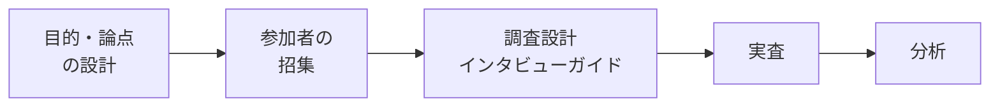

# lesson20: 定性調査 — ユーザーの生の声と行動に迫る

## このレッスンで学ぶこと

- 定性調査の代表的な手法（インタビュー・観察・エスノグラフィーなど）の特徴を説明できる
- 定性リサーチの基本プロセス（設計から分析まで）を理解する
- リクルーティングとインタビューガイドの役割を理解する
- KJ法による分析と、インタビュー実施時のコツを知る

## 定性調査とは

定性調査は、ユーザーの発言や行動といった**質的データ**から、思考・感情・行動の背景を深く理解する調査です。少数のユーザーを「個」として丁寧に見ることで、数値だけでは見えない文脈や理由をつかみます。

[lesson18](/lessons/lesson18/) で学んだとおり、定性調査は仮説探索（新しい気づきを得る）に向いています。仮説の検証を主目的とする定量調査（[lesson19](/lessons/lesson19/)）と往復しながら使うのが基本です。

## 定性調査の手法バリエーション

| 手法 | 概要 | 特徴 |
|------|------|------|
| デプスインタビュー | 1対1の深掘り型の**インタビュー** | 個人の行動や心理を時間をかけて深く聞ける |
| **グループインタビュー** | 複数の参加者で座談会形式で話を聞く | 参加者同士の相互作用で発言が広がる。同調が起きやすい点に注意 |
| **ユーザー観察** | ユーザーが製品を使う様子を観察する | 発言ではなく実際の行動を捉えられる |
| **フィールドワーク** | 利用現場に出向いて調べる | 制御された会議室ではなく、現実の文脈で調査できる |
| **エスノグラフィー** | 生活や仕事の場に入り込み、行動を文脈ごと観察・記録する | 文化人類学由来。本人も自覚していないニーズの発見に向く |
| **ダイアリー法** | ユーザー自身に日記形式で体験を記録してもらう | 長期間・日常の文脈での変化を捉えられる |

::: tip 「言うこと」と「すること」を組み合わせる
インタビューは意識データ（言うこと）、観察系の手法は行動データ（すること）を捉えます。発言と行動には隔たりがあるため、両者を組み合わせると理解が立体的になります。
:::

## 定性リサーチのプロセス

定性リサーチは思いつきで話を聞くのではなく、次の5ステップで計画的に進めます。

### ステップ1: 目的・論点の設計

まず、事業やプロジェクトの課題から「このリサーチで何を明らかにするか」という目的を定め、論点（リサーチクエスチョン）を3〜5個程度に絞り込みます。

- 論点ごとに「仮説の探索なのか検証なのか」を明確にする
- 対象とする仮説の種類（ターゲット仮説・利用シーン仮説・課題仮説など）をはっきりさせる
- 論点が明確になると、採用すべき調査手法が決まる

### ステップ2: リクルーティング（参加者の招集）

**リクルーティング**とは、調査目的に合う参加者の条件を定義して招集することです。定性調査は少数精鋭のため、「誰に聞くか」が結果を大きく左右します。

- 条件は「必須条件（譲れない条件）」「優先条件」「割付（属性ごとの人数配分）」に分けて定義する
- 人数はおおむね3〜8名程度が目安。セグメントごとに分析するなら各3名以上が望ましい
- 招集方法には、調査会社のパネルへのアンケート配信、知人ネットワーク経由の機縁法などがある

::: info エクストリームユーザー
新規性の高いテーマでは、平均的なユーザーよりも極端なユーザー（独自の工夫をする人・まったくの未経験者など）に聞くほうが、ヒントを得やすい場合があります。
:::

### ステップ3: 調査設計とインタビューガイド

**調査設計**では、論点をインタビュー項目へ分解し、当日の進行を組み立てます。質問と進行をまとめた台本が**インタビューガイド**です。

進行の固定度によって、設計には3つのタイプがあります。

| タイプ | 内容 | 向く手法 |
|--------|------|----------|
| 構造化 | 決められた質問を決められた順序で実施する | 条件をそろえたいユーザーテスト |
| 半構造化 | 大枠は決めつつ、状況に応じて質問を変更・追加する | デプスインタビュー |
| 非構造化 | 最低限のポイントだけ用意し、相手の文脈に沿って進める | エスノグラフィー、ユーザー観察 |

インタビューガイドを作る際のポイントは次のとおりです。

- 答えやすい質問から答えにくい質問へ、自然な流れで並べる
- 質問を「必須」と「任意」に分け、ブロックごとに所要時間を見積もる
- 「具体的でオープンな質問」（例: きっかけは何でしたか）を基本に組み立てる

### ステップ4: 実査（インタビューのコツ）

実査とは、計画に基づいて実際に調査を実施することです。インタビューでは次の点に注意します。

- **誘導しない**: モデレーター自身の意見は言わず、答えを示唆する枕詞（「気づいていましたか」など）を避ける
- **事実と意見を切り分ける**: 実際にした行動（事実）と、願望・感想（意見）を区別して聞く
- **一度に複数のことを聞かない**: 質問は1つずつシンプルにする
- **「なぜ」を直接聞きすぎない**: 理由を直接たずねると後付けの説明になりがち。具体的な行動や状況を聞き、行動の理由を深掘る
- **分からない点は粘り強く聞く**: 「教えてもらう」姿勢で、曖昧な点は遠慮せず確認し続ける

### ステップ5: 分析

分析は、得られた発言や観察記録をさまざまな角度から構造化し、当初の論点に答えていく作業です。比較する、分類する、要因を分解するといった操作を組み合わせます。

代表的な構造化の手法が**KJ法**です。川喜田二郎が考案した手法で、次のように進めます。

1. 発言や観察された事実を1件ずつカードに書き出す
2. 内容が似ているカードを集めてグループを作り、見出しを付ける
3. グループ同士の関係（因果・対立など）を図にして、全体の構造を読み解く

分析の結果は、ターゲットの選定や提供価値の定義など、具体的な提言（示唆）につなげます。ユーザーモデリングへの展開は [lesson22](/lessons/lesson22/) で学びます。

## キーワード

| 用語 | 説明 |
|------|------|
| インタビュー | ユーザーに直接質問して意識データを得る手法。1対1の深掘り型はデプスインタビュー |
| グループインタビュー | 複数の参加者から座談会形式で話を聞く手法。発言の広がりと同調リスクが特徴 |
| ユーザー観察 | ユーザーの実際の行動を観察し、行動データを得る手法 |
| フィールドワーク | 利用の現場に出向いて行う調査 |
| エスノグラフィー | 生活・仕事の場に入り込み、行動を文脈ごと観察・記録する手法 |
| ダイアリー法 | ユーザー自身に日記形式で体験を記録してもらう手法 |
| リクルーティング | 調査目的に合う参加者の条件定義と招集 |
| 調査設計 | 論点を質問項目へ分解し、調査の進行を組み立てる工程 |
| インタビューガイド | 質問内容と進行をまとめた、インタビューの台本 |
| KJ法 | 事実をカード化しグループ化して構造を読み解く、川喜田二郎考案の分析手法 |

## 試験のポイント

- 定性調査は仮説探索（新しい気づきの獲得）に向く、という位置づけを押さえる
- 各手法の特徴の対応（エスノグラフィーは現場での文脈ごとの観察、ダイアリー法は長期間の自己記録など）が問われやすい
- プロセスの順序「目的・論点の設計 → リクルーティング → 調査設計（インタビューガイド）→ 実査 → 分析」を覚える
- リクルーティングでは「少数精鋭だからこそ条件定義が重要」という点と、3〜8名程度という人数の目安を押さえる
- KJ法は「川喜田二郎」「カード化とグループ化による構造化」をセットで覚える
- インタビューの注意点（誘導しない・事実と意見を分ける・「なぜ」を直接聞きすぎない）も出題されうる
