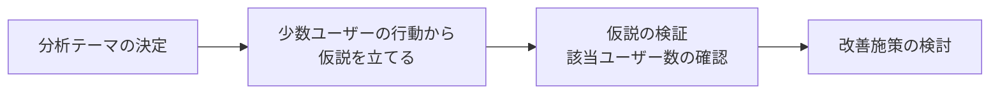
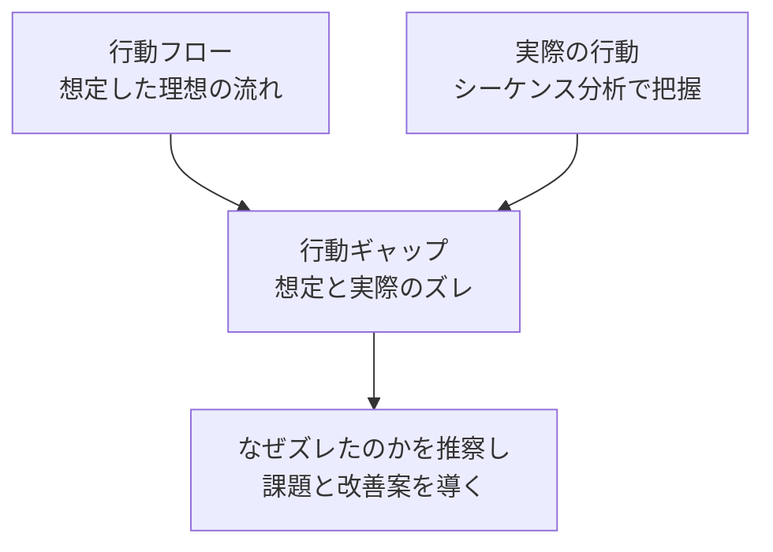

# lesson21: 行動データ分析 — 行動の流れからユーザーを理解する

## このレッスンで学ぶこと

- 行動データ（ログ）が「実際に何をしたか」を示すデータであることを理解する
- 個々のユーザーの行動を時系列で読むシーケンス分析の特徴を理解する
- 行動フローと実際の行動のズレ（行動ギャップ）から課題を発見する方法を知る
- ペインポイント・ゲインポイントの違いと、UX改善への活かし方を知る

## 行動データとは

**行動データ**とは、アプリの操作ログや購買履歴のように、ユーザーが**実際に何をしたか**を記録したデータです。

- アンケートやインタビューで得られる意識データ（本人の認識・自己申告）と対になる概念（[lesson18](/lessons/lesson18/) 参照）
- 記憶や自己申告に頼らないため、事実（ファクト）として扱える
- スマートフォンやセンサーの普及で、日常の行動が大量に記録されるようになった

**行動データ分析**とは、この行動履歴をもとに仮説を検証し、課題を見つける分析です。

::: info 行動データにも限界がある
行動データからは「何をしたか」は分かっても、「なぜそうしたか」までは分かりません。理由は行動から推察し、必要に応じて定性調査（[lesson20](/lessons/lesson20/)）で確かめます。
:::

## 集計データからシーケンス分析へ

### 集計データだけでは文脈が見えない

従来のデータ分析は、売上やアクセス数などの**集計データ**が中心でした。集計データは全体の傾向をつかむには便利ですが、弱点もあります。

- 個々のユーザーの行動の特徴が、平均化されて消えてしまう
- 「数値が動いた」という結果は分かっても、背景にあるプロセスが分からない

たとえばコンビニで「鮭おにぎりの売上が急に伸びた」と分かっても、売上データだけでは理由を推測しにくいものです。「運動会帰りらしい親子連れが何組も買っていく」様子まで見えれば、「来週の運動会に向けて関連商品も仕入れよう」と次の打ち手につながります。

### シーケンス分析

**シーケンス分析**とは、ユーザーIDごとの行動データを**時系列の一連の流れ（シーケンス）として読む**分析手法です。

- 「検索→商品ページ→離脱→後日再訪→購入」のように、1人のユーザーの行動を順番に追う
- 行動の前後関係から、つまずいた場所や行動の理由を推察しやすい
- 専門的な統計の知識がなくても直感的に読めるため、データの専門家以外も分析・企画に参加しやすい

シーケンス分析は、おおむね次のステップで進めます。

::: tip 1人ずつ全員を見るわけではない
シーケンス分析の目的は、課題が表れる「共通の行動パターン」を見つけることです。分析テーマに関係する状況に絞って数名から十数名の行動を読み、同じ行動を取るユーザーがどの程度いるかを集計データで確かめます。
:::

## 行動ギャップから課題を見つける

### 行動フローと行動ギャップ

**行動フロー**とは、サービス提供者が想定する「ユーザーにこう動いてほしい」という理想の行動の流れです。**行動ギャップ**とは、この行動フローと実際の行動とのズレを指します。

ギャップそのものが答えではなく、「ユーザーはなぜそう動いたのか」という状況の推察が重要です。見つけた課題を単純に裏返すのではなく、ユーザーにとって理想の体験から改善案を考えます。

### 例: 飲食店メディアの高級レストラン特集

- 想定（行動フロー）: 高収入層が特集を見て、好みの高級店をそのまま予約する
- 実際の行動: 普段は低価格帯の店を見ているユーザーが、価格の下限を何度も変えて検索し、かなり先の日付で予約していた
- 推察: 利用者は富裕層ではなく、記念日など「特別な日」のために高級店を探す一般の人だった
- 打ち手: 訴求を「特別な日の食事」向けに変更し、予約数が大きく伸びた

## ペインポイントとゲインポイント

行動を読むときの代表的な着眼点が、ペインポイントとゲインポイントです。

| 用語 | 意味 | 例 |
|------|------|----|
| ペインポイント | ユーザーが不満・不便・障害を感じている点 | 入力フォームで何度もエラーになり離脱する |
| ゲインポイント | うまくいっている点。ユーザーが価値を感じる瞬間 | 新着通知から好みの商品をすぐ見つけて購入している |

- ペインポイントの解消は、離脱や不満の原因を取り除く改善につながる
- ゲインポイントの強化は、うまくいっている体験をより多くのユーザーへ広げる改善につながる
- 「不満をつぶす」だけでなく「価値を感じる瞬間を伸ばす」視点を持つことが重要

## UXグロースとの関係

行動データ分析が最も力を発揮するのは、[lesson04](/lessons/lesson04/) で学んだUXグロースのうち、**ボトムアップ型の高速改善**の場面です。

- すでにある顧客接点（デジタルサービスなど）を、日常的に行動を見ながら小さく速く改善する
- 施策を打って終わりではなく、施策後に再びシーケンス分析で行動を確かめ、改善サイクルを回し続ける
- 新規事業のアイデア探索や幅広い市場理解には向かない点に注意する

定量的な行動データと、定性調査で得る理由の理解を組み合わせることで、顧客理解の解像度が高まっていきます。

## キーワード

| 用語 | 説明 |
|------|------|
| 行動データ | ユーザーが実際に何をしたかを記録したデータ（操作ログ・購買履歴など） |
| 行動データ分析 | 行動履歴をもとに仮説を検証し、課題を見つける分析 |
| 行動フロー | サービス提供者が想定する理想のユーザー行動の流れ |
| シーケンス分析 | ユーザーIDごとの行動を時系列の一連の流れとして読む分析手法 |
| 行動ギャップ | 想定した行動フローと実際の行動とのズレ。課題発見の起点 |
| ペインポイント | ユーザーが不満・不便・障害を感じている点 |
| ゲインポイント | うまくいっている点。ユーザーが価値を感じる瞬間 |

## 試験のポイント

- 行動データは「実際に何をしたか」を示す事実のデータであり、意識データ（思っていること）と区別する
- シーケンス分析の特徴は、集計データではなく「ユーザーIDごとの時系列の行動」を読む点にある
- 行動ギャップは「想定した行動フロー」と「実際の行動」のズレ。2つの用語をセットで覚える
- ペインポイント（不満・障害）とゲインポイント（価値を感じる瞬間）の対比は頻出
- 行動データ分析の使いどころは「高速改善のUXグロース」。新規事業の探索には向かない
