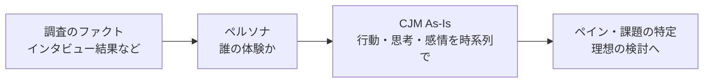

# lesson22: ユーザーモデリング（現在の利用状況の把握） — ユーザーの「今」を見える化する

## このレッスンで学ぶこと

- なぜ顧客像をフレームワークで可視化する必要があるのかを理解する
- ペルソナが「属性の羅列」ではなく「1人の具体的な人物像」である理由を説明できる
- カスタマージャーニーマップ（As-Is）で行動・思考・感情を時系列に可視化する方法を理解する
- UXカーブ・タスク分析・KA法・エンパシーマップ・ジョブ理論の特徴を区別できる

## ユーザーモデリングとは

ユーザーモデリングとは、調査で得た事実をもとに、**ユーザーの現在の利用状況（体験）を整理して見える形にする**活動です。

[lesson18](/lessons/lesson18/) 〜 [lesson21](/lessons/lesson21/) のリサーチで集めた情報は、そのままでは断片的なデータの山です。ペルソナやカスタマージャーニーマップなどのフレームワークでモデル化することで、ユーザー要求の定義に使える形になります。

### 顧客像を可視化する理由

可視化の最大の目的は、**チームで顧客像の共通認識を持つこと**です。

- 「ユーザー」という言葉だけで議論すると、メンバーそれぞれが「自分の想像上のユーザー」を思い浮かべてしまう
- 想像のズレに気づかないまま進むと、課題の解釈も施策の方向性もバラバラになる
- モデルとして可視化すれば、課題・方針・施策をチーム全員が同じ目線で議論できる

背景として、顧客ニーズの多様化とデジタルテクノロジーの発展があります。マス向けの一律のアプローチではなく、自社の製品・サービスに適した顧客層を特定して深く理解する必要性が高まっています。

::: warning 調査にもとづいて作る
ユーザーモデリングは「自分がユーザーならこうするはず」という想像では作りません。[lesson20](/lessons/lesson20/) の定性調査を中心とした、実際のユーザー調査のファクトをもとに作成します。
:::

## ペルソナ

**ペルソナ**は、顧客を代表する**仮想の1人の人物像**です。氏名・価値観・生活サイクル・情報収集の方法・判断軸まで、実在するかのように具体的に描きます。

### 属性の羅列ではなく「物語」

「30代女性・子どもあり・利用経験は数回」のようなデモグラフィック属性（年齢・性別などの人口統計的な属性）の羅列では、その人の困りごとやアイデアを具体的に考えられません。「知り合いのあの人」のように顔が浮かぶ1人を描くからこそ、チームは課題を体感できます。

よいペルソナの条件は次の3つです。

- その人が大事にしていること（物事の優先順位）がわかる
- その人の判断軸が見えてくる
- その人の達成したい目的が明確である

### ペルソナの効果と留意点

| 観点 | 内容 |
|------|------|
| 効果1 | ペルソナに「憑依」して課題を体感しやすくなる |
| 効果2 | チーム内で顧客像の共通認識を持てる |
| 効果3 | 「この人ならどう感じるか」と施策の妥当性を判断する基準になる |
| 留意点1 | 実在の人物である必要はない。実在のエッセンスを取り入れた架空・仮想の人物でよい |
| 留意点2 | 企業にとって都合のよい「理想の顧客像」として描かない。リアリティを優先する |
| 留意点3 | ペルソナ起点のアイデアは、近い別セグメントにも有効な場合が多い |

## カスタマージャーニーマップ（As-Is）

**カスタマージャーニーマップ（CJM）**は、ユーザーが製品・サービスと関わる一連のプロセスを、**行動・思考・感情・タッチポイントの時系列ストーリー**として可視化するフレームワークです。現状の体験を描くものを **As-Is**（現状）、理想の体験を描くものを To-Be（理想）と呼びます。To-Be は [lesson23](/lessons/lesson23/) で扱います。

### 構成要素

| 要素 | 内容 |
|------|------|
| フェーズ | 認知・比較・購入・利用などの体験の段階 |
| 行動 | 各フェーズでユーザーが実際にすること |
| タッチポイント | 企業・情報との接点（広告・店舗・アプリなど） |
| 思考 | その時ユーザーが考えていること |
| 感情 | 気持ちの浮き沈み。曲線で描くとペインポイントが見つけやすい |

### 作成の効果と落とし穴

CJM を作ると、ユーザーの行動・思考・感情から発想する顧客起点（マーケットイン）の検討が徹底され、体験の全体像を踏まえて打ち手の優先順位を判断できます。

| よくある落とし穴 | 改善ポイント |
|------------------|--------------|
| 企業目線の内容になる | 常に「顧客の言葉」で書く |
| 浅い記述で理解が深まらない | 解像度を上げて具体的に書く |
| 作って終わりになる | 現実とのズレを定期的に見直して精度を高める |

## そのほかの現状把握の手法

ペルソナと CJM 以外にも、目的に応じて使い分ける手法があります。

| 手法 | 概要 | 向いている場面 |
|------|------|----------------|
| UXカーブ | 利用開始から現在までの体験の満足度を、ユーザー自身に時系列の曲線で振り返って描いてもらう | 長期利用の中で評価が変化した時点と理由を知りたいとき |
| タスク分析 | 目的達成までのユーザーの行動を、操作レベルの細かい作業単位（タスク）に分解する | 省略・統合できる手順などシステムや操作の課題を洗い出すとき |
| KA法 | 調査で得た出来事から「心の声」を読み取り、その背後にあるユーザーにとっての価値を抽出する | 行動の記録から本質的な価値を導き出したいとき |
| エンパシーマップ | 「見ているもの」「聞いていること」「考えていること」「感じていること」などの枠でユーザーの状況を感情面中心に整理する | ユーザーの認識や感情への共感を深めたいとき |
| ジョブ理論 | ユーザーは特定の状況で成し遂げたい進歩（ジョブ）のために製品を「雇う」と捉える（詳細は [lesson03](/lessons/lesson03/)） | 機能ではなく「何のために使うのか」から考えたいとき |

## キーワード

| 用語 | 説明 |
|------|------|
| ユーザーモデリング | 調査のファクトをもとにユーザーの現在の利用状況を可視化する活動 |
| ペルソナ | 顧客を代表する仮想の1人の人物像。価値観・判断軸・生活まで具体的に描く |
| カスタマージャーニーマップ | 行動・思考・感情・タッチポイントを時系列ストーリーで可視化するフレームワーク |
| As-Is | 現状の体験を描く時制。理想を描く To-Be と対になる |
| UXカーブ | 体験の満足度の変化を時系列の曲線で振り返ってもらう手法 |
| タスク分析 | ユーザーの行動を細かい作業単位に分解して課題を把握する手法 |
| KA法 | 出来事と心の声からユーザーにとっての価値を抽出する分析手法 |
| エンパシーマップ | 見る・聞く・考える・感じるなどの枠で感情面を中心に整理するフレームワーク |
| ジョブ理論 | ユーザーが製品を「雇う」理由＝ジョブに着目する考え方 |

## 試験のポイント

- ユーザーモデリングの目的は**チームの共通認識づくり**。想像ではなく**調査のファクト**にもとづく点とセットで覚える
- ペルソナは**仮想の1人**でよいが、**企業に都合のよい理想像にしない**。属性の羅列との違いが問われやすい
- CJM（As-Is）は**行動・思考・感情・タッチポイントを時系列で**可視化する。As-Is（現状）と To-Be（理想）の時制の区別は頻出
- UXカーブ（満足度の曲線）・タスク分析（作業単位への分解）・KA法（価値の抽出）・エンパシーマップ（感情の整理）・ジョブ理論（雇う理由）は、**手法名と着眼点の対応**を正確に覚える
