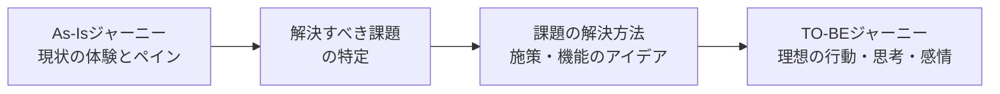

# lesson23: 理想の利用状況の想定 — あるべき体験を描く

## このレッスンで学ぶこと

- なぜ現状把握の次に「理想の利用状況」を描く必要があるのかを理解する
- TO-BEジャーニーで理想の体験を時系列に可視化する方法を理解する
- バリュープロポジションの意味とバリュー・プロポジション・キャンバスの構造を説明できる
- ユーザーストーリーマッピングで必要な機能を整理し優先順位を付ける流れを知る

## なぜ理想の利用状況を描くのか

[lesson22](/lessons/lesson22/) のユーザーモデリングで、現状（As-Is）の体験とペイン（悩み・不満）が見えてきました。しかし現状を知っただけでは、まだ何を作るべきかは決まりません。

次のことを具体的に検討するために、**理想の利用状況（To-Be）**を定義します。

- 現状の体験のどこに、誰にとっての課題があるのか
- その課題をどのような形で解決するのか
- 解決策はユーザーにどんな価値を、どんな利用文脈で届けるのか

検討の際に共通して大切なのは次の2点です。

- **As-Is で見えた顧客にとっての理想**を考える。「自社にとって理想的」な姿にすり替えない
- ひとりで考えず**チームでアイデアを出し合う**。視野が広がり、優先順位の合意形成もしやすい

## TO-BEジャーニー

**TO-BEジャーニー**は、理想の体験を一連のストーリーとして描く**理想のカスタマージャーニーマップ**です。As-Is のカスタマージャーニーマップ（CJM、[lesson22](/lessons/lesson22/) 参照）で可視化した体験を「どう変革・改善すればよいか」を検討するために作ります。

### 作り方のポイント

- As-Is と同じく、行動・思考・タッチポイント・感情の動きを時系列の線で捉える
- As-Is から見えた**解決すべき課題**と**解決方法（施策）**を書き加え、実現後に起こる体験の変化を描く
- 既存サービスの改善なら自社で作るべき状態を、新規サービスの企画なら自社で提供できる範囲と他社と協力すべき範囲を見極める材料になる

::: warning 顧客視点を忘れない
To-Be を描くときも主語はユーザーです。「（事業者目線で）こうに違いない」「（自社にとって）理想的」という発想に流れていないか、常に確認しましょう。
:::

## バリュープロポジション

**バリュープロポジション**とは、**ユーザーが求める価値と、企業が提供できる価値の重なり**のことです。「ユーザーが欲しがっていて、かつ自社だからこそ提供できる価値」を言葉にしたものと言えます。

この重なりを探すための代表的なフレームワークが**バリュー・プロポジション・キャンバス（VPC）**です。製品・サービスの提供価値とユーザーのニーズの間のギャップを明らかにします。

### バリュー・プロポジション・キャンバスの構造

VPC は「顧客プロファイル」と「価値マップ」の2つの面を突き合わせる構造になっています。

| 面 | 要素 | 内容 |
|----|------|------|
| 顧客プロファイル（顧客の現状） | ジョブ | 特定の状況で顧客が成し遂げたい進歩（[lesson22](/lessons/lesson22/) のジョブ理論） |
| 顧客プロファイル（顧客の現状） | ペイン | 顧客の悩み・嫌なこと |
| 顧客プロファイル（顧客の現状） | ゲイン | 顧客の利益・嬉しいこと |
| 価値マップ（提供すべき価値） | 製品・サービス | 提供する製品・サービス・機能 |
| 価値マップ（提供すべき価値） | ペインリリーバー | 顧客の悩みを取り除くもの |
| 価値マップ（提供すべき価値） | ゲインクリエーター | 顧客に利益をもたらすもの |

作成はまず顧客側から始めます。ジョブを定め、ペインとゲインを洗い出してから、それに応える製品・サービス、ペインリリーバー、ゲインクリエーターの順に検討します。両面がかみ合ったとき、そこにバリュープロポジションが成立します。

::: tip 順序が大切
先に「作りたい機能」から埋めると、企業都合の発想（プロダクトアウト）に逆戻りします。**顧客プロファイルから先に**埋めることで、顧客起点の価値定義になります。
:::

## ユーザーストーリーマッピング

**ユーザーストーリーマッピング**は、**ユーザーの行動の流れに沿って必要な機能を並べ、優先順位を付ける**手法です。理想の体験を、開発する機能の計画へと橋渡しします。

| 軸 | 並べるもの |
|----|------------|
| 横軸 | ユーザーの行動の流れ（例: 商品を探す → 比較する → 購入する → 受け取る） |
| 縦軸 | 各行動を支える機能やユーザーストーリーを、優先度の高い順に上から並べる |

横軸の体験の流れを保ったまま、上の段から水平に区切ることで「最初のリリースに含める最小限の機能」を切り出せます。

- 体験の全体像を見ながら機能の抜け漏れと優先順位を確認できる
- 「どの機能から作るか」をチームで合意しやすい
- 優先順位付きの機能一覧は、アジャイル開発（[lesson08](/lessons/lesson08/)）のプロダクトバックログづくりにつながる

## キーワード

| 用語 | 説明 |
|------|------|
| To-Be | 理想の状態を表す時制。現状を表す As-Is と対になる |
| TO-BEジャーニー | 理想の体験を時系列ストーリーで描く理想のカスタマージャーニーマップ |
| バリュープロポジション | ユーザーが求める価値と企業が提供できる価値の重なり |
| バリュー・プロポジション・キャンバス | 顧客プロファイルと価値マップを突き合わせて提供価値を定義するフレームワーク |
| 顧客プロファイル | VPC の顧客側。ジョブ・ペイン・ゲインで構成される |
| 価値マップ | VPC の企業側。製品・サービス、ペインリリーバー、ゲインクリエーターで構成される |
| ユーザーストーリーマッピング | ユーザーの行動の流れに沿って必要な機能を並べ、優先順位を付ける手法 |

## 試験のポイント

- 理想の利用状況は **As-Is で見えた顧客にとっての理想**として描く。「自社にとっての理想」とのすり替えはひっかけの定番
- TO-BEジャーニーは As-Is と同じ構成（行動・思考・感情・タッチポイント）に**課題と解決方法**を加えて理想の体験を描く
- バリュープロポジションは「**求める価値と提供できる価値の重なり**」。定義をそのまま問われやすい
- VPC の6要素は**面との対応**で覚える。顧客プロファイル＝ジョブ・ペイン・ゲイン、価値マップ＝製品・サービス・ペインリリーバー・ゲインクリエーター
- ユーザーストーリーマッピングは「**行動の流れに沿って機能を並べ、優先順位を付ける**」手法。アジャイル開発との接点も押さえる
