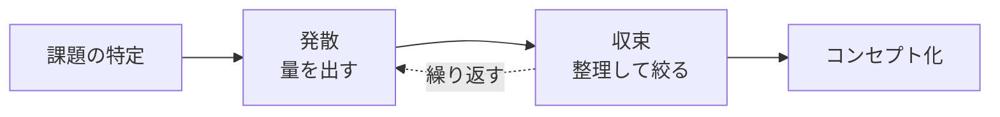

# lesson24: アイデア創出 — 発想を広げて、まとめる

## このレッスンで学ぶこと

- アイデア創出における発散と収束の使い分けを理解する
- ブレインストーミングの4原則を説明できる
- カードソート・特性要因図など、アイデアを整理・構造化する手法を知る
- シナリオ・共感的デザイン・参加型デザインなど、ユーザー視点を取り込む手法を知る

## アイデア創出の基本: 発散と収束

ユーザー調査で課題が見えたら、次は解決のアイデアを生み出す段階です。アイデアを生み出す手法を総称して**発想法**と呼びます。

発想法を使いこなすコツは、**発散**と**収束**という2つのモードを意識的に使い分けることです。

| モード | 目的 | 進め方の例 |
|------|------|-----------|
| 発散 | アイデアの数と幅を広げる | 評価せずにとにかく出す（ブレインストーミングなど） |
| 収束 | アイデアを整理・評価して絞り込む | グルーピングや構造化で本質を見つける（カードソートなど） |

::: tip 発散と収束を混ぜない
アイデアを出しながら同時に評価すると、発想が萎縮して量が出なくなります。「今は発散の時間」「ここからは収束の時間」と段階を分けることが、よいアイデアへの近道です。この発散と収束の繰り返しは [lesson07](/lessons/lesson07/) のデザイン思考プロセスにも組み込まれています。
:::

## 発散の代表手法: ブレインストーミング

**ブレインストーミング**は、複数人で自由にアイデアを出し合う発散の代表的な手法です。オズボーンが考案しました。

成立の鍵は、次の**4原則**を全員が守ることです。

| 原則 | 内容 |
|------|------|
| 批判禁止 | 出されたアイデアを批判・評価しない |
| 自由奔放 | 突飛なアイデア・粗削りなアイデアを歓迎する |
| 質より量 | よいアイデアを狙うより、まず数を出す |
| 結合便乗 | 他人のアイデアに乗っかり、組み合わせて発展させる |

::: warning 試験で問われやすい点
4原則は「批判禁止・自由奔放・質より量・結合便乗」のセットで覚えます。とくに「質より量」を「量より質」と入れ替えたひっかけに注意してください。
:::

## 収束の代表手法

### カードソート

**カードソート**は、情報やアイデアを1枚ずつカードに書き出し、グルーピングして構造を見いだす手法です。

- ブレインストーミングで出た大量のアイデアを、意味の近さでまとめて整理する
- Webサイトのメニュー分類をユーザー自身に並べてもらい、ユーザーの頭の中の分類を知る

このように、アイデアの収束にも情報の分類にも使えます。情報の分類への応用は [lesson25](/lessons/lesson25/) の情報設計に直接つながります。

### 特性要因図

**特性要因図**は、結果（特性）とその原因（要因）の関係を、魚の骨のような形で構造化する図です。形から**フィッシュボーン図**とも呼ばれます。

- 頭の部分に解決したい結果（例: 「アプリの解約が多い」）を置く
- 大骨に主要な原因のカテゴリ、小骨に具体的な原因をぶら下げる
- 原因を網羅的に洗い出すことで、対策のアイデアを考える土台ができる

## ユーザー視点を取り込む手法

アイデアは作り手の思いつきだけで進めると、ユーザーの実態から離れていきます。ユーザー視点を発想に取り込む手法を3つ紹介します。

### シナリオ

**シナリオ**は、ユーザーが製品・サービスを使う様子を物語（ストーリー）として記述する手法です。

- 「誰が・どんな状況で・何をして・どう感じるか」を時間の流れに沿って文章で描く
- 機能の一覧では見えない利用の文脈や感情を表現できる
- [lesson22](/lessons/lesson22/) のペルソナを主人公にすると、具体性が高まる

### 共感的デザイン

**共感的デザイン**は、ユーザーの利用現場を観察し、本人も言葉にできていないニーズに共感することから発想するアプローチです。

- インタビューで「聞く」だけでなく、現場で「見る」ことを重視する
- 無意識の工夫や我慢（不便への対処行動）が、新しいアイデアの種になる
- 観察の手法は [lesson20](/lessons/lesson20/) の定性調査と深く関わる

### 参加型デザイン

**参加型デザイン**は、ユーザーを観察対象ではなく**設計のパートナー**として、デザインプロセスに直接巻き込むアプローチです。

- ワークショップなどでユーザーと一緒にアイデアを出し、形にする
- 作り手の思い込みを早い段階で正せる
- 北欧で発展した伝統があり、コ・デザイン（共創）とも呼ばれる

::: info 共感的デザインと参加型デザインの違い
どちらもユーザー視点を重視しますが、共感的デザインは「観察して作り手が共感する」、参加型デザインは「ユーザー本人が設計に参加する」という関わり方の違いがあります。
:::

## キーワード

| 用語 | 説明 |
|------|------|
| 発想法 | アイデアを生み出すための手法の総称。発散と収束を使い分ける |
| ブレインストーミング | 複数人で自由にアイデアを出し合う発散手法。4原則（批判禁止・自由奔放・質より量・結合便乗）が鍵 |
| カードソート | 情報やアイデアをカードに書き出し、グルーピングして構造を見いだす収束手法 |
| 特性要因図 | 結果と原因の関係を魚の骨の形で構造化する図。フィッシュボーン図とも呼ぶ |
| シナリオ | ユーザーの行動・状況・感情を物語として記述する手法 |
| 共感的デザイン | ユーザーの現場を観察し、言葉にされないニーズへの共感から発想するアプローチ |
| 参加型デザイン | ユーザーを設計のパートナーとしてデザインプロセスに巻き込むアプローチ |

## 試験のポイント

- 発散（量を広げる）と収束（整理して絞る）の区別と、各手法がどちらに属するかを整理しておく
- ブレインストーミングの4原則（批判禁止・自由奔放・質より量・結合便乗）は頻出。「質より量」の向きに注意
- カードソートは「グルーピングによる構造化」、特性要因図は「原因の構造化（フィッシュボーン）」と役割で覚える
- シナリオは「物語として記述」、共感的デザインは「観察からの共感」、参加型デザインは「ユーザーが設計に参加」とキーフレーズで区別する
