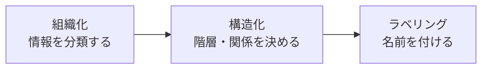

# lesson25: 情報設計 — 情報を正しく伝える構造をつくる

## このレッスンで学ぶこと

- 情報設計（Information Architecture）の目的と基本プロセスを理解する
- 組織化・構造化・ラベリングという情報設計の3つのステップを知る
- サイトマップ・ディレクトリマップ・ワイヤーフレームなど代表的なアウトプットを区別できる
- 導線設計とUI設計が情報設計とどう関係するかを説明できる

## 情報設計（Information Architecture）とは

**Information Architecture（情報アーキテクチャ、IA）**とは、ユーザーが情報を見つけやすく、理解しやすいように、**情報を整理・構造化する設計分野**です。日本語では情報設計とも呼ばれます。

たとえばECサイトで「商品がどこにあるかわからない」「メニューの言葉の意味がわからない」と感じたことはないでしょうか。これらは見た目の問題ではなく、情報の整理と構造の問題、つまりIAの問題です。

::: info 5階層モデルとの対応
[lesson01](/lessons/lesson01/) で学んだギャレットの5階層モデルでは、情報設計は主に「構造」と「骨格」の階層にあたります。戦略・要件を踏まえて情報を組み立て、表層（ビジュアルデザイン）の土台を作る位置づけです。
:::

## 情報設計の基本プロセス

情報設計は、おおまかに次の3ステップで進めます。

| ステップ | 内容 | 例（ECサイト） |
|------|------|-----------|
| 組織化 | 情報を一定の基準でグループに分類する | 商品を「メンズ」「レディース」「キッズ」に分ける |
| 構造化 | グループ間の階層や関係を設計する | トップ > レディース > バッグ > トートバッグ |
| ラベリング | 各グループ・項目にユーザーが理解できる名前を付ける | 社内用語の「EC2部商材」ではなく「バッグ」と表記する |

::: tip 分類はユーザーの頭の中に合わせる
作り手の組織図や都合で分類すると、ユーザーには見つけられません。[lesson24](/lessons/lesson24/) で学んだカードソートをユーザーに実施してもらうと、ユーザー自身の分類のしかた（メンタルモデル）を情報設計に反映できます。
:::

## 情報設計の代表的なアウトプット

### サイトマップとディレクトリマップ

サイト全体の構造を表す設計図には、主に2つの形式があります。

| アウトプット | 形式 | 主な用途 |
|------|------|-----------|
| サイトマップ | ページの階層関係を樹形図のように図で表す | 全体構造の把握・関係者との合意形成 |
| ディレクトリマップ | 全ページをURL・タイトルなどとともに一覧表で管理する | ページの抜け漏れ確認・制作と運用の管理 |

どちらも「サイトにどんなページがあり、どういう階層に置かれるか」を定義する点は共通です。図で俯瞰するのがサイトマップ、表で網羅するのがディレクトリマップと覚えるとよいでしょう。

### ワイヤーフレーム

**ワイヤーフレーム**は、1つの画面の中に「どんな情報・機能を、どこに、どんな優先順位で置くか」を線と枠で表した**画面の骨格設計図**です。

- 配色・写真・装飾は含めず、レイアウトと情報の優先順位に集中する
- 見た目の好みの議論を避けて、情報の過不足や配置を先に固められる
- ワイヤーフレームに動きや見た目を加えて検証する手法は [lesson26](/lessons/lesson26/) のプロトタイピングで扱う

::: warning ワイヤーフレームとビジュアルデザインを混同しない
ワイヤーフレームは「何をどこに置くか（骨格）」を決めるもので、「どんな見た目にするか（表層）」を決めるビジュアルデザインとは目的が異なります。5階層モデルの「骨格」と「表層」の違いに対応します。
:::

## 導線設計

**導線設計**とは、ユーザーが迷わずに目的の情報や操作へたどり着けるように、**サイトやアプリ内の移動経路を設計する**ことです。

- 「トップページから3クリックで商品詳細に着けるか」のように、入口から目的地までの経路を設計する
- ナビゲーションメニュー・検索・パンくずリスト・バナーなどが経路の部品になる
- 設計した経路（導線）に対して、実際にユーザーがたどった経路を「動線」と呼んで区別することがある

導線が悪いと、情報がサイト内に存在していてもユーザーには「ない」のと同じになります。離脱や問い合わせの増加に直結するため、情報設計の重要な仕上げです。

## UI設計との関係

[lesson01](/lessons/lesson01/) で学んだとおり、**ユーザーインターフェース（UI）**は製品とユーザーの接点です。画面・ボタン・メニューなどのUIは、情報設計の結果をユーザーに見える形にしたものといえます。

- 情報設計が崩れていると、表面のUIをきれいに整えてもユーザーは目的を達成できない
- 逆に情報設計が適切なら、UIはシンプルでも使いやすくなる
- 使いやすさの評価基準は [lesson14](/lessons/lesson14/) のユーザビリティで扱う

## キーワード

| 用語 | 説明 |
|------|------|
| Information Architecture | 情報アーキテクチャ（IA）。情報を見つけやすく理解しやすいように整理・構造化する設計分野 |
| 組織化・構造化・ラベリング | 情報設計の基本ステップ。分類し、階層化し、わかる名前を付ける |
| サイトマップ | ページの階層構造を樹形図のように表した設計図 |
| ディレクトリマップ | 全ページをURL・タイトルなどとともに一覧表で管理する設計図 |
| ワイヤーフレーム | 画面内の情報・機能の配置と優先順位を線と枠で表した骨格設計図 |
| 導線設計 | ユーザーが迷わず目的に到達できるよう移動経路を設計すること |
| ユーザーインターフェース | 製品とユーザーの接点（UI）。情報設計の結果が画面として表れる場所 |

## 試験のポイント

- Information Architecture（IA）は「情報の整理・構造化」を担う設計分野という定義を押さえる
- 組織化（分類）→構造化（階層）→ラベリング（命名）の3ステップを順序とセットで覚える
- サイトマップ（図で階層を俯瞰）とディレクトリマップ（表で全ページを網羅）の違いが問われやすい
- ワイヤーフレームは「画面の骨格」であり、ビジュアルデザイン（表層）とは別物という区別を押さえる
- 導線設計は「ユーザーが迷わず目的に到達する経路の設計」という目的ベースの定義で覚える
