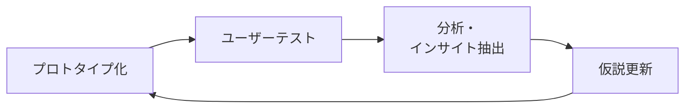

# lesson26: プロトタイピング — 作って試して手戻りを減らす

## このレッスンで学ぶこと

- プロトタイピングが「完成前に作って試す」ことで手戻りを減らす手法だと理解する
- 忠実度の軸（ローファイ／ハイファイ）の違いと使いどころを説明できる
- 範囲の軸（水平プロトタイプ・垂直プロトタイプ・Tプロトタイプ）を区別できる
- ペーパープロトタイプとオズの魔法使いという代表的な手法を知る

## プロトタイピングとは

プロトタイピングとは、**試作品（プロトタイプ）を作ってユーザーに使ってもらい、評価と改善を繰り返す手法**です。ユーザーやサービスに関する仮説を、検証できる形に簡易的に具現化します。

完成してから問題が見つかると、修正には大きなコストがかかります。完成前の段階で「作って試す」ことで、問題を早く発見し、**手戻りを減らす**ことがプロトタイピングの狙いです。

::: tip 最初から完璧を目指さない
最初からうまくいくプロトタイプは作れない、と割り切ることが大切です。検証で見つかった課題をつぶしながら、仮説とプロトタイプの精度を段階的に上げていきます。
:::

## 忠実度の軸（ローファイ／ハイファイ）

プロトタイプは、完成品にどれだけ近いか（忠実度、フィデリティ）で分類できます。

| 分類 | 忠実度 | 例 | 特徴 |
|------|--------|----|------|
| ローファイ | 低い | 紙のスケッチ、手書きの画面、スライド資料 | 早く・安く作れる。アイデアの方向性の検証に向く |
| ハイファイ | 高い | 画面遷移が動くモック、ビジュアルまで作り込んだテストサイト | 実物に近い体験で検証できる。作る手間とコストは大きい |

方向性を探る初期段階では、デザインの細部まで作り込む必要はありません。検証したいポイントが表現されていれば、手書きの紙でも十分に機能します。

### ペーパープロトタイプ

**ペーパープロトタイプ**は、画面を紙に手書きして検証するローファイなプロトタイプの代表例です。

- 紙とペンがあればすぐ作れるため、思いついたその日に検証できる
- 作り込んでいないぶん、ユーザーも率直な意見を言いやすい
- ボタンを押したら次の画面の紙に差し替える、といった方法で操作の流れも再現できる

## 範囲の軸（水平・垂直・Tプロトタイプ）

プロトタイプは「どの範囲をどの深さまで作るか」でも分類できます。

| 分類 | 作る範囲 | 向いている検証 |
|------|----------|----------------|
| 水平プロトタイプ | 機能の幅を広く、それぞれは浅く作る | 全体のメニュー構成や画面遷移など、サービス全体の構造 |
| 垂直プロトタイプ | 特定の機能だけを深く作り込む | 検索や決済など、特定機能が使い物になるかどうか |
| Tプロトタイプ | 全体を浅く作り、一部の機能だけ深く作る | 全体の構造と主要機能の両方（水平と垂直の組み合わせ） |

::: info Tプロトタイプの名前の由来
アルファベットの「T」の形のとおり、横棒が「広く浅い全体」、縦棒が「深く作り込んだ一部の機能」を表しています。
:::

## オズの魔法使い

**オズの魔法使い**は、システムが自動で動いているように見せかけて、**実際には裏で人間が操作して応答する**検証手法です。

- 例: チャットボットの検証で、ユーザーの入力に対して裏側で人間が回答を返す
- システムを実装する前に「この機能はユーザーに受け入れられるか」を検証できる
- 名前は、物語『オズの魔法使い』でカーテンの裏に人間が隠れていたことに由来する

## 目的に応じた使い分け

どのプロトタイプを使うかは、検証したい目的に合わせて選びます。

| 検証したいこと | 適した選択 |
|----------------|------------|
| アイデアの方向性を素早く確かめたい | ローファイ（ペーパープロトタイプ） |
| 実物に近い操作感や見た目の印象を確かめたい | ハイファイ |
| サービス全体の構成・画面遷移を確かめたい | 水平プロトタイプ |
| 特定機能の実現性・使い勝手を深く確かめたい | 垂直プロトタイプ |
| 全体の構成と主要機能をあわせて確かめたい | Tプロトタイプ |
| 実装前に機能の受容性を確かめたい | オズの魔法使い |

::: warning 比較検証では条件をそろえる
複数案を比較するときは、焦点となる箇所以外を同じ条件にそろえます。たとえばボタンの位置を検証したいのに文言まで変えてしまうと、どちらの影響か判断できなくなります。
:::

プロトタイプを実際にユーザーに使ってもらって評価する方法は、[lesson28](/lessons/lesson28/) のユーザーテストで学びます。

## キーワード

| 用語 | 説明 |
|------|------|
| プロトタイプ | 仮説を簡易的に具現化した試作品。ユーザーテストで検証に使う |
| ローファイ | 忠実度の低いプロトタイプ。紙やスケッチで早く安く作れる |
| ハイファイ | 忠実度の高いプロトタイプ。実物に近い体験で検証できる |
| ペーパープロトタイプ | 画面を紙に手書きして検証するローファイの代表的手法 |
| 水平プロトタイプ | 機能の幅を広く浅く作るプロトタイプ。全体構造の検証向き |
| 垂直プロトタイプ | 特定の機能を深く作り込むプロトタイプ。特定機能の検証向き |
| Tプロトタイプ | 全体を浅く、一部だけ深く作る、水平と垂直を組み合わせた形 |
| オズの魔法使い | 裏で人間が操作し、システムが動作しているように見せる検証手法 |

## 試験のポイント

- プロトタイピングの目的は「完成前に作って試す」ことで問題を早期に発見し、手戻りを減らすこと
- ローファイ（紙・スケッチ、早く安い）とハイファイ（実物に近い、手間がかかる）の対比を押さえる
- 水平（幅広く浅く）・垂直（特定機能を深く）・T（全体は浅く+一部深く）の3つは形のイメージとセットで覚える
- オズの魔法使いは「裏で人間が動かして、動作しているように見せる」手法。実装前の検証に使える点が問われやすい
- 複数案の比較では、検証したい箇所以外の条件をそろえる
