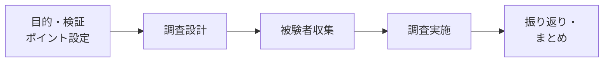

# lesson28: ユーザーテスト — ユーザー目線で有効性を検証する

## このレッスンで学ぶこと

- ユーザーテストが「実際に使ってもらう」定性調査であることを理解する
- 思考発話法と回顧法の違いを説明できる
- パフォーマンス測定で何を測るかを知る
- ニールセンの公式と反復デザインの考え方を理解する
- インフォームドコンセント・個人情報保護など倫理面の配慮を知る

## ユーザーテストとは

**ユーザーテスト**とは、サービスの開発・改善の中で行われる、**実際にユーザーに使ってもらう定性調査**です。ユーザビリティテストと呼ばれることもあります。

- ユーザーにタスク（課題）を与え、操作する様子を観察して問題を発見する
- 被験者（テストに協力してもらう人）は必ずしも「実ユーザー」である必要はない（社員や知人でも、調査をしないよりはるかによい）
- [lesson26](/lessons/lesson26/) で作ったプロトタイプの評価にも、リリース済みサービスの現状把握にも使える

::: tip 「意見を聞く」ではなく「行動を見る」
「こんな機能が欲しい」といった意見は、その場の雰囲気や体裁で簡単に変わるため、あてになりません。ユーザーテストでは、行動という「事実」とその理由を明らかにします。
:::

## ユーザーテストの進め方

事前に目的と検証ポイントを決め、仮説を持って臨むことが重要です。漫然と眺めるだけでは、行動への「違和感」に気づけず、課題を発見できません。また、タスクは「〇〇を購入してください」のような機械的な指示ではなく、ユーザーにとって自然な利用状況を設定して使ってもらうようにします。

調査では「利用行動の観察」と「行動についての振り返りヒアリング」をセットで繰り返します。

## 発話を引き出す2つの方法

ユーザーの頭の中を知るための代表的な方法が、思考発話法と回顧法です。

| 手法 | やり方 | 長所 | 短所 |
|------|--------|------|------|
| 思考発話法 | 操作しながら、考えていることをその場で声に出してもらう | 思考をリアルタイムに把握できる | 発話すること自体が行動に影響することがある |
| 回顧法 | テスト終了後に、録画などを見ながら行動を振り返ってもらう | 自然な行動を妨げない | 記憶があいまいになり、後づけの説明が混ざることがある |

## パフォーマンス測定

**パフォーマンス測定**は、タスクの実行結果を数値で測る方法です。定性的な観察とあわせて使うことで、改善の効果を客観的に比較できます。

- タスク達成率（タスクを完了できた人の割合）
- タスクの所要時間
- 操作エラーの回数

## ニールセンの公式と反復デザイン

ユーザビリティの専門家ヤコブ・ニールセンは、**5人程度のテストでユーザビリティ問題の約85%を発見できる**という経験則（ニールセンの公式）を示しました。

この公式から導かれる実践方針が**反復デザイン**です。大人数のテストを1回行うのではなく、**少人数のテストと改善を何度も繰り返す**ほうが効率的に品質を高められます。

::: info なぜ5人でよいのか
テスト人数を増やしても、発見される問題は途中から重複が多くなります。同じ予算なら、1回に人数をかけるより、回数を重ねるほうが多くの問題を解消できます。
:::

## 実施環境（ユーザビリティラボ）

**ユーザビリティラボ**は、ユーザーテスト専用の施設です。

- マジックミラー越しに、関係者が別室からユーザーの様子を観察できる
- 画面・表情・操作を記録するカメラなどの設備が整っている
- 現在はオンライン会議ツールを使った**リモートでのユーザーテスト**も広く行われている

## 倫理面の配慮

被験者に協力してもらう調査では、倫理面への配慮が欠かせません。

| 配慮事項 | 内容 |
|----------|------|
| インフォームドコンセント | 調査の目的・記録の方法・データの利用範囲などを事前に説明し、同意を得てから実施する |
| 個人情報保護 | 氏名・連絡先・録画データなどの個人情報を、同意書に記載した目的・範囲の中で適切に利用・管理する |

::: warning 同意は「事前に」「文書で」
録画や録音をともなう調査では、開始前に同意書で説明と同意の記録を残します。取得したデータを同意の範囲を超えて使うことはできません。
:::

専門家の目線で評価する方法（エキスパートレビュー）との使い分けは、[lesson29](/lessons/lesson29/) で学びます。

## キーワード

| 用語 | 説明 |
|------|------|
| ユーザーテスト | 実際にユーザーに使ってもらい、行動を観察して問題を発見する定性調査 |
| 思考発話法 | 操作中に考えていることを声に出してもらう方法 |
| 回顧法 | テスト終了後に行動を振り返って語ってもらう方法 |
| パフォーマンス測定 | タスク達成率・所要時間などを数値で測定する方法 |
| ニールセンの公式 | 5人程度のテストで約85%のユーザビリティ問題を発見できるという経験則 |
| 反復デザイン | 少人数のテストと改善を繰り返して品質を高める進め方 |
| ユーザビリティラボ | マジックミラーや記録設備を備えたユーザーテスト専用施設 |
| インフォームドコンセント | 調査内容を事前に説明し、被験者の同意を得ること |
| 個人情報保護 | 被験者の氏名・録画データなどを同意の範囲で適切に扱うこと |

## 試験のポイント

- ユーザーテストは「実際に使ってもらう」**定性調査**。協力者は実ユーザーでなくてもよい点に注意
- 「意見を聞く」のではなく「行動を見る」が大原則。意見があてにならない理由とセットで覚える
- 思考発話法（その場で発話）と回顧法（終了後に振り返り）の対比は頻出
- ニールセンの公式は「**5人で約85%**」という数字と、そこから導かれる**反復デザイン**（少人数×複数回）をセットで覚える
- インフォームドコンセントは「事前の説明と同意」。個人情報保護とあわせて倫理面の配慮として問われる
