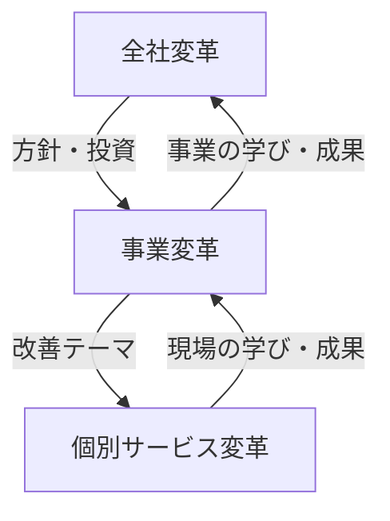

# lesson31: 組織開発と人材育成 — UXグロースを支える組織の仕組みと人の育て方

## このレッスンで学ぶこと

- UXの取り組みに個人のスキルだけでなく組織の仕組みが必要な理由を理解する
- 変革の3階層（全社変革・事業変革・個別サービス変革）と相互循環の関係を説明できる
- 部門横断のグロースチームの構成と、活動の2本柱（新機能開発・運用改善）を知る
- スキルマップとカリキュラムを使ったUX人材育成の進め方と留意点を理解する

## 組織の仕組みが必要な理由

優秀なUXデザイナーが1人いても、組織のUXは変わりません。理由は次のとおりです。

- UXは企画・開発・運用・サポートなど多くの部門の仕事の積み重ねで決まる
- 担当者が異動・退職すると、属人的な取り組みは止まってしまう
- 現場の改善と経営の方針がかみ合わないと、努力が成果につながらない

[lesson04](/lessons/lesson04/) で学んだとおり、UXグロース活動には経営層が主導するトップダウン型と、現場が主導するボトムアップ型があります。この2つを両立させる組織機能と連携のあり方が、このレッスンのテーマです。

## 変革の3階層と相互循環

UXによる変革は、3つの階層に整理できます。

| 階層 | 単位 | 内容 |
|------|------|------|
| 全社変革 | 全社 | 経営層が戦略・組織・評価指標をUX起点に変える |
| 事業変革 | 事業 | 事業単位でビジネスモデルや提供価値を見直す |
| 個別サービス変革 | サービス | 個々のサービス・接点のUXを改善する |

3つの階層は一方通行ではなく、**相互循環**の関係にあります。

- 上から下へ: 全社の方針が事業の戦略になり、個別サービスの改善テーマに落ちる
- 下から上へ: 個別サービスで得た成果や顧客理解が、事業や全社の戦略を見直す材料になる

::: info なぜ循環が必要か
方針が下りてくるだけでは現場の実態と離れ、現場の改善だけでは全社の変革に届きません。上下の循環があって初めて、組織全体のUXグロースが続きます。
:::

## グロースチームの構成（部門横断）

ボトムアップ型のUXグロースを担うのがグロースチームです。最大の特徴は、**部門横断**でメンバーを集めることです。

| メンバー | 役割 |
|---------|------|
| 運用担当者 | サービスの日々の運用を担い、現場で起きていることを最もよく知る |
| カスタマーサクセス | 顧客の成功を支援し、顧客の声やつまずきをチームに届ける |
| データサイエンティスト | 行動データを分析し、改善の根拠と検証を支える |
| デザイナー | 改善案をUI・体験の形に落とし込む |
| エンジニア | 改善を実装し、リリースする |

部門横断にする理由は、次の3点です。

- 改善のヒントは運用やサポートの現場に集まる（運用担当者・カスタマーサクセス）
- 改善の判断には行動データの裏付けが要る（データサイエンティスト）
- 改善の実行には設計と実装が要る（デザイナー・エンジニア）

部門ごとに分かれたままでは、発見から実行までのバトンリレーのたびに時間と情報が失われます。1つのチームに集めることで、改善のサイクルを高速に回せます。

## 活動の2本柱（新機能開発と運用改善）

グロースチームの活動は、大きく2つに分かれます。

| 活動 | 内容 |
|------|------|
| 新機能開発 | 新しい機能・接点を加えて、ジャーニー（利用の流れ。詳細は [lesson22](/lessons/lesson22/)）を伸ばす |
| 運用改善 | 既存の機能・接点を磨き込み、日々の体験の質を高める |

::: warning 新機能開発に偏らない
新機能は目立ちますが、ユーザーの体験の大半は既存機能の使い心地で決まります。地道な運用改善を軽視すると、「機能は増えるのに体験は悪くなる」事態に陥ります。
:::

## ビジネスモデルキャンバス（事業構造の共通言語）

部門横断のチームでは、職種ごとに見ている世界が違います。そこで役立つのが、事業の構造を9つのブロックで1枚に整理するフレームワーク、**ビジネスモデルキャンバス**です。

- 顧客側: 顧客セグメント・価値提案・チャネル・顧客との関係
- 提供側: 主要活動・主要リソース・パートナー
- お金の流れ: 収益の流れ・コスト構造

チーム全員が同じ1枚を見ることで、「この改善は事業のどこに効くのか」を共通言語で議論できます。UX企画力（[lesson05](/lessons/lesson05/)）に含まれるビジネス理解を支える道具でもあります。

## UX人材育成

組織の仕組みと並ぶもう1つの柱が**人材育成**です。UX人材は採用だけでは確保しきれないため、社内で計画的に育てる必要があります。

### スキルマップによる現状把握

**スキルマップ**は、必要なスキルの一覧と各メンバーの習熟度を整理した表です。組織に必要なスキル（リサーチ・データ分析・UIデザインなど）を洗い出し、メンバーごとの現在地を可視化して、足りないスキルを特定します。

### カリキュラムによる計画的な育成

現状が見えたら、**カリキュラム**として育成計画に落とし込みます。研修とOJTを組み合わせるのが基本です。

| 手段 | 内容 |
|------|------|
| 研修 | 体系的な知識を効率よく学ぶ（座学・ワークショップ） |
| OJT | 実際のプロジェクトの中で実践しながら学ぶ |

::: tip 育成の留意点
求められるスキルはサービスのフェーズで変わり、立ち上げ期には新しいサービスを構想する力、グロース期にはデータ分析と改善の実行力の比重が高まります。スキルマップもカリキュラムも、作って終わりにせず更新し続けることが大切です。
:::

## キーワード

| 用語 | 説明 |
|------|------|
| 全社変革 / 事業変革 / 個別サービス変革 | UXによる変革の3階層。全社・事業・個別サービスの単位で取り組む |
| 相互循環 | 上位の方針が下位の改善テーマになり、下位の学びが上位の戦略を見直す双方向の関係 |
| 部門横断 | 複数の部門からメンバーを集めてチームを組むこと。グロースチームの基本 |
| 運用担当者 / カスタマーサクセス / データサイエンティスト | グロースチームの主要メンバー。現場の実態・顧客の声・データ分析をチームに持ち寄る |
| 新機能開発 / 運用改善 | グロースチームの活動の2本柱。ジャーニーの伸長と既存体験の磨き込み |
| ビジネスモデルキャンバス | 事業の構造を9ブロックで1枚に整理する、事業構造の共通言語 |
| 人材育成 | UX人材を社内で計画的に育てる取り組み |
| スキルマップ / カリキュラム | 必要なスキルと習熟度を可視化する表と、その差分を埋める育成計画 |

## 試験のポイント

- 変革の3階層は「全社変革・事業変革・個別サービス変革」。単位（全社・事業・サービス）との対応と、一方通行ではなく**相互循環**する点をセットで覚える
- グロースチームは**部門横断**が特徴。運用担当者・カスタマーサクセス・データサイエンティスト・デザイナー・エンジニアなどの構成メンバーと役割を整理する
- 活動の2本柱は「新機能開発」と「運用改善」。新機能だけでなく既存体験の磨き込みも対等な柱である点を押さえる
- ビジネスモデルキャンバスは「事業構造の**共通言語**」という位置づけで覚える
- 人材育成は「スキルマップで現状把握、カリキュラムで計画的に育成」という順序と、研修とOJTの組み合わせを押さえる
