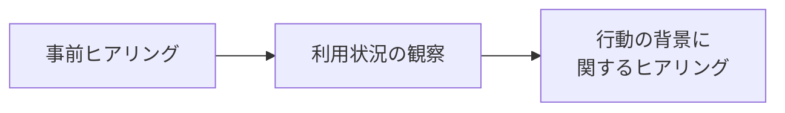

# lesson33: AIペルソナと行動観察調査 — 初期仮説と実ユーザー検証の組み合わせ

## このレッスンで学ぶこと

- AIペルソナインタビューの仕組みと限界を説明できる
- AIペルソナが価値を発揮する使い方を理解する
- ユーザー行動観察調査の基本的な流れと重要な視点を説明できる

## AIペルソナインタビューとは

AIの進化によって、ユーザー理解の方法にも変化が生まれています。その1つが**AIペルソナインタビュー**です。AIを使って仮想的なユーザー像（ペルソナ）を作成し、そのAIに対してインタビューする方法で、次の3ステップで実行できます。

1. AIでユーザー像（ペルソナ）を作成する
2. AIにそのペルソナをトレースするよう指示し、インタビューする
3. そこから得た気づきをサービス設計に反映する

まだユーザー調査を実施できていない段階で、想定されるユーザーの考え方や困りごとを仮説として整理する際に役立ちます。

## AIペルソナの限界

AIペルソナインタビューで得られる理解には上限があります。目安として「75点程度」と表現されることがあり、満点には届きません。実際のユーザー像をつかむ作業は、本物の顧客への行動観察やインタビューを通じて、必ず別途行う必要があります。

なぜなら、AIが作るユーザー像は過去のデータや一般的な傾向の集約にすぎないからです。もっともらしい回答は返せても、目の前のユーザーが置かれた個別の事情や、本人さえ気づいていない判断のクセまでは映し出せません。

::: warning AIは「市場がない」と言い切れない
世の中にニーズのなさそうな突飛な商品でも、ターゲットユーザーを尋ねればAIは律義に生成してしまいます。AIは「そのようなイノベーションは絶対に起きない」と断言することが難しいため、可能性を無理に拡張してターゲット像を作り出してしまう傾向があります。
:::

最新の情報や時系列の変化（SNSでの流行など）を正確に反映しきれない、という限界もあります。

## AIペルソナが価値を生む場面

AIペルソナの価値は「75点しか出せないこと」ではなく「**75点を圧倒的な速度で出せること**」にあります。従来、新規事業やサービス改善はゼロからユーザー像・課題を考え始めることが多く、担当者ごとに前提が異なり議論が噛み合わないこともありました。AIペルソナを使えば、初期仮説を短時間で大量に生成でき、チーム内で「まず何を検証すべきか」の共通認識を作りやすくなります。

大事なのは、AIの答えをそのまま鵜呑みにしないことです。示された仮説をたたき台として、「本当にそうか」「実際のユーザーに聞いて確かめるべき点はどこか」を考えることにこそ意味があります。AIペルソナは正解を出す道具ではなく、検証の糸口を見つけるための道具だと捉えます。

AIが果たす役割は、ユーザー理解を完結させることではありません。理解を始めるための出発点を、圧倒的な速さで用意してくれることにあります。そこから先を実際のユーザーとの対話や観察で埋めていく作業こそが、他社に差をつける本物のユーザー理解につながります。

## ユーザー行動観察調査

AIペルソナで初期仮説を高速に作れるようになったからこそ、その仮説を実際のユーザーで検証する重要性はこれまで以上に高まっています。その役割を担う手法の1つが**ユーザー行動観察調査**です。

ユーザーの「意見」ではなく「実際の行動」を観察し、その背景にある判断基準や価値観を読み解く調査手法です。基本的な流れは次のとおりです。

ポイントは2つあります。

1つ目は、**意見より行動を重視する**ことです。人は自分の行動を正確に説明できるとは限りません。「簡単でした」と答えていても、実際には何度も画面を見返し迷いながら操作していることがあります。行動には本人も気付いていない判断や迷いが表れるため、UXでは「何を言ったか」だけでなく「何をしたか」を重視します。

2つ目は、**事前に仮説を持つ**ことです。仮説を持たずに観察を始めると、「何となく迷っていた」という事実は拾えても、それがなぜ重要なのかまでは読み解けません。ここでAIペルソナの初期仮説が役立ちます。想定と違う行動を実際のユーザーが見せた瞬間こそ、深掘りすべき合図になるからです。目指すのは仮説を的中させることではなく、AIが用意した仮説を現場での観察を通じて磨き直すことです。想定と現実のずれこそが、新しい発見を生む一番の材料になります。

::: tip AIと人間の役割分担
AIが仮説をつくり、人間が現場で確かめる。この組み合わせで初めて本質的なユーザー理解に到達できます。
:::

## キーワード

| 用語 | 説明 |
|------|------|
| AIペルソナインタビュー | AIで仮想的なユーザー像を作り、そのAIに対してインタビューする手法 |
| ユーザー行動観察調査 | ユーザーの意見ではなく実際の行動を観察し、背景の判断基準を読み解く調査手法 |
| 意見より行動 | ユーザーの発言と実際の行動は一致するとは限らないため行動を重視するという考え方 |

## 試験のポイント

- AIペルソナインタビューの3ステップと、「75点程度」という限界の表現を押さえる
- AIペルソナの価値は「速く仮説を作れること」であり、結論ではなく検証すべき論点を発見するツールである点に注意する
- ユーザー行動観察調査は「意見より行動」「事前に仮説を持つ」の2点が重要
